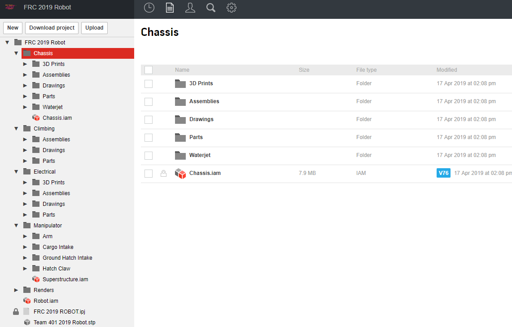

# CAD Repository Structuring

This document provides a general structure for CAD repositories. While it is focused on robot projects, if you're doing something non-robot (cart, pit, etc) try to keep a similar structure so we stay organized.

## Project root:
* Folders for each subsystem
* Renders folder
* Robot.iam assembly file
* Robot project file (.ipj)
     * Should be locked to one person)

## For each subsystem folder:
* 3D Prints folder
     * Contains STL files, ZCode files here
* Assemblies folder
     * Lower level assemblies (.iam) for the subsystem.
     * Optionally contains a Subassemblies folder if needed
* Drawings folder
     * Contains all engineering drawings (.idw) for the subsystem
* Parts folder
     * Contains all custom part files for the subsystem.
     * Most part files (.ipt) go here. The exception being geometry sketches.
* Sketches folder
     * Contains geometry sketches (.ipt) used for system design.
* Optional folders for Waterjet / Plasma / CNC layouts
     * Assemblies, parts, sketches, and DXFs intended solely for CNC use should go here.
* Subsystem overall assembly (eg. `Chassis.iam`)

### Example structure from 2019 Robot Project:
