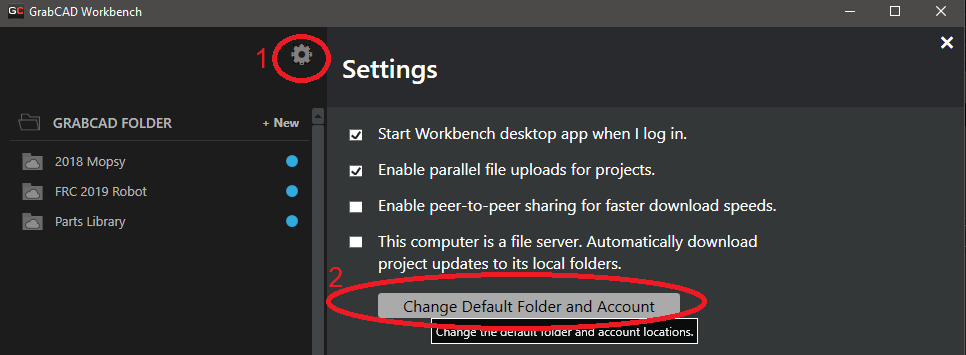

# GrabCAD

GrabCAD is " a free cloud-based collaboration environment that helps engineering teams manage, view and share CAD files." Team 401 uses GrabCAD for all of our CAD storage and publishing. GrabCAD lets us do version control, file locking, online previews, and maintain a library of COTS parts.

## Procedure for joining the Team 401 GrabCAD:
1. Sign up for GrabCAD at this address: [https://grabcad.com/profile/register](https://grabcad.com/profile/register). Make sure you write down exactly the email address you use, you'll need it for step 3.
2. Download and install [GrabCAD Workbench](https://workbench.grabcad.com/workbench/download) if you don't have it already installed.
3. Request that a team leader add you to the team on GrabCAD. Follow up on this if they don't. Make sure they get your email address exactly correct, GrabCAD is picky.
4. After being added to projects if you don't see the expected list of projects in the desktop app, you may have the wrong default account setup. To fix this, go to the settings menu in the app and click "Change default folder and account."

## Notes on uploading to GrabCAD
* Always read the list of what you're about to upload before you actually do upload - don't upload things that you didn't actually work on!
* Never upload OldVersions folders or files, GrabCAD serves this purpose for us and they are unnecessary.
* Design Accelerator and FEA folders should be uploaded if you want them to work for other people (you do).
* Always add a meaningful commit message so that people can know what you worked on.

## Other GrabCAD notes:
* If you download or make a new COTS (component off the shelf) part it should go in the Parts Library with correct mass, materials, and appearance assigned. 
* If you modify a COTS part it should be saved as `COTS PART NAME - MODIFICATION NOTE` in the current project - not the Parts Library.
* If you are working on a file and don't want anyone else to mess with it you can lock the file from the GrabCAD web or desktop interface. Admins can override this but will ask you before they do so.