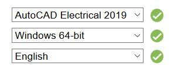
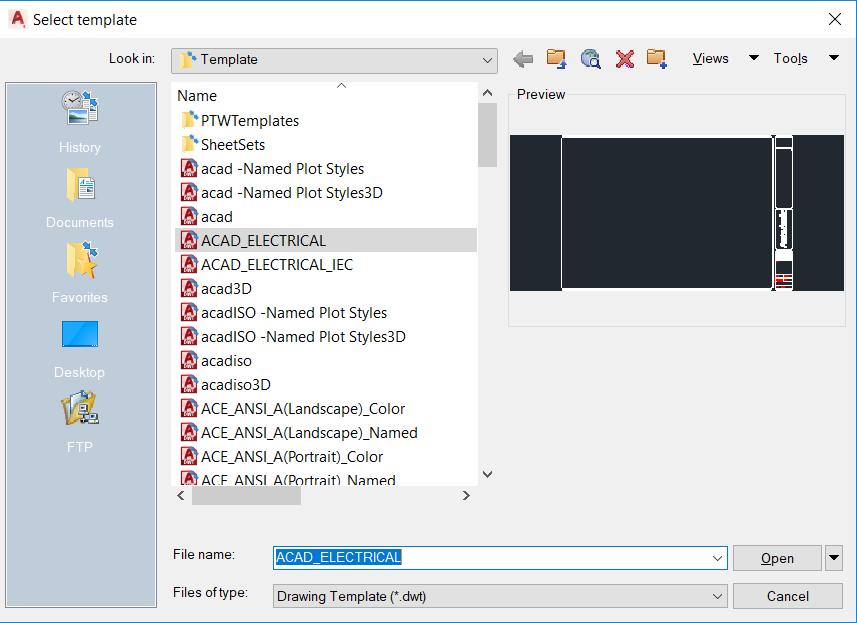

# AutoCAD Electrical

Team 401 uses AutoCAD Electrical to create robot wiring diagrams in order to clearly show the components and connections of our controls system. Over the last two years, the team has developed a symbol library of commonly used FRC components which can be found in GrabCAD.

## Getting Started

### Downloading AutoCAD Electrical

Go to [https://www.autodesk.com/education/free-software/autocad-electrical](https://www.autodesk.com/education/free-software/autocad-electrical). In order to download the program, you will have to create an Autodesk account. After doing so, use the dropdown menus on this page to select the 2019 version of AutoCAD Electrical and specify your operating system and preferred language. An example of this is shown:

 

Then, click "Install Now."

### Drawing and Project Setup

Click the AutoCAD Electrical icon in the upper left corner and click “New,” and then “Drawing.” This will bring up a menu of templates. Select “ACAD_ELECTRICAL” from the list of templates.

