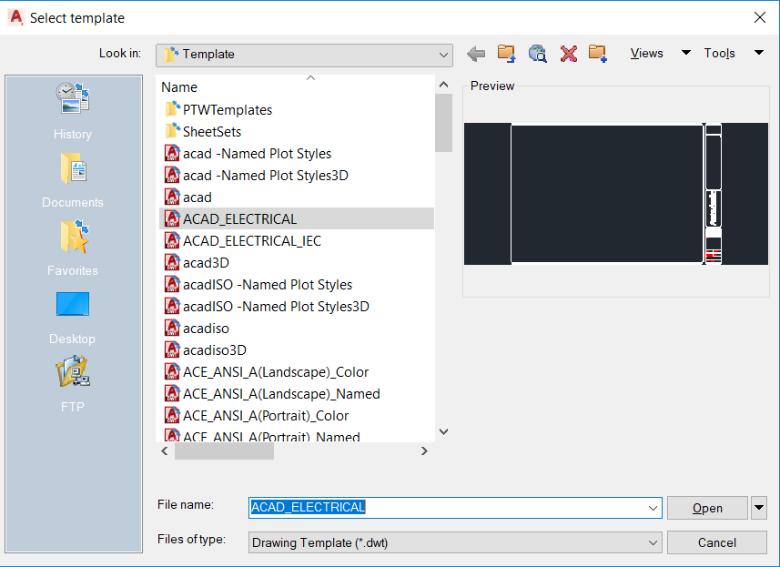
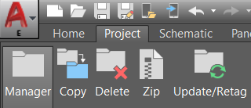
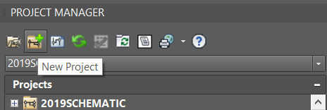
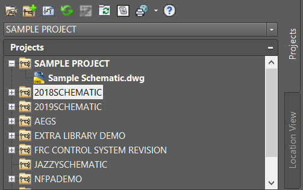
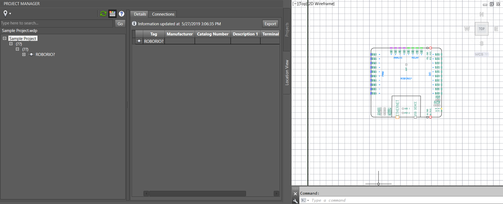
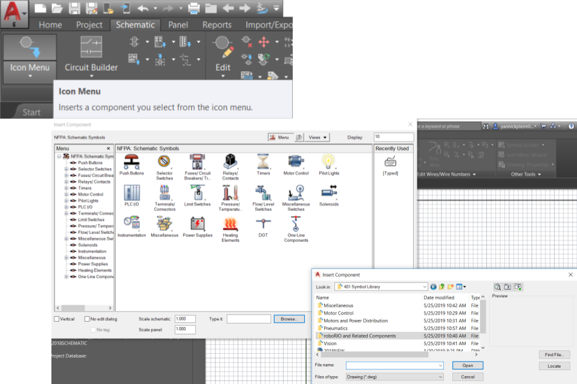
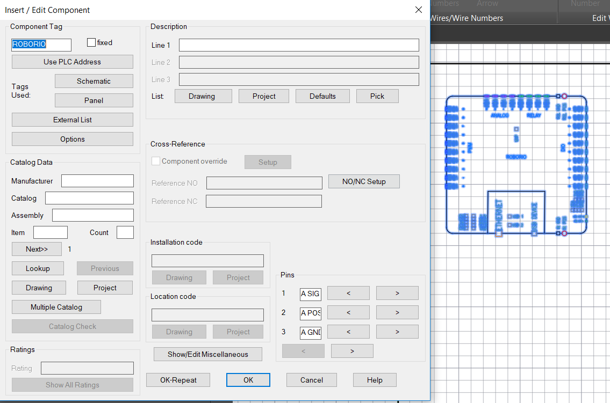
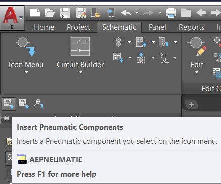
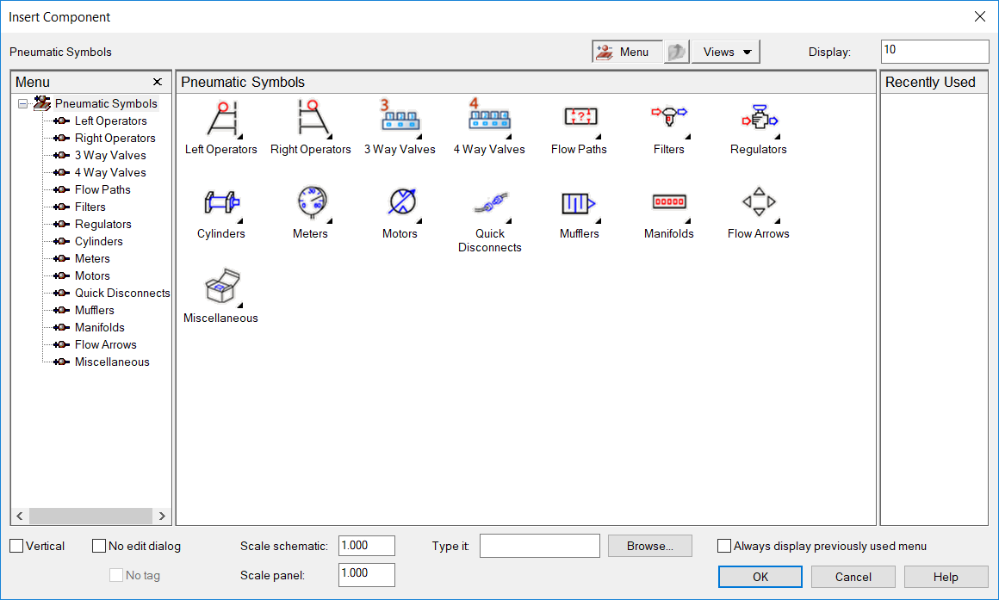

# AutoCAD Electrical

Team 401 uses AutoCAD Electrical to create robot wiring diagrams in order to clearly show the components and connections of our controls system. Over the last two years, the team has developed a symbol library of commonly used FRC components which can be found in GrabCAD.

1. TOC
{:toc}

## Getting Started

### Downloading AutoCAD Electrical

Go to [https://www.autodesk.com/education/free-software/autocad-electrical](https://www.autodesk.com/education/free-software/autocad-electrical). In order to download the program, you will have to create an Autodesk account. After doing so, use the dropdown menus on this page to select the 2019 version of AutoCAD Electrical and specify your operating system and preferred language. An example of this is shown:

 

Then, click "Install Now." Follow the instructions of the AutoCAD Electrical installer.

### Drawing and Project Setup

Click the AutoCAD Electrical icon in the upper left corner and click “New,” and then “Drawing.” This will bring up a menu of templates. Select “ACAD_ELECTRICAL” from the list of templates.

If the Project Manager is not already open, navigate to the tabs above the drawing and select the “Project” tab. Click the “Manager” button to open the Project Manager, which should appear to the left of the drawing.

The project in bold is the active project. In order to create a new project, click the folder with the green plus at the top of the Project Manager. 

Name said project, then right click it in the Project Manager and select “Activate” to make it the active project. Save the drawing, and then add the drawing to the project by right clicking the project folder and then selecting “Add Active Drawing.”

Now, you should be able to expand the project and see that the drawing has been added:

The Project Manager can also display the connections between components in the schematic as well as details about each component. This information can be located under the "Location View" tab, as can be seen in this example:

## AutoCAD Electrical Basics

### Placing Components

Team 401 uses a combination of custom-made symbols and built-in AutoCAD Electrical symbols for certain pneumatic components. 

#### 401 Symbol Library

In order to place a component from the 401 Symbol Library, you must have GrabCAD installed and the Parts Library downloaded. Use [this guide](GrabCAD.md) to set up your GrabCAD.

Navigate to the "Schematic" tab and select the "Icon Menu" option. This will pull up a window with the built-in AutoCAD Electrical symbols categorized by type. At the bottom of this window, there is a "Browse" button. Click "Browse" and navigate to Documents>GrabCAD>Parts Library>Electrical>401 Symbol Library.

As can be seen, the symbol library is organized by component function. For example, a Power Distribution Panel would be found under "Motors and Power Distribution." Double-click a symbol to insert it into the drawing, and then click where you would like to place the symbol. This will pull up a window where the component's name can be altered and a description can be added or edited. 

Remove the "?" from the end of the component's name, and if needed add a number to the end of the component's name for duplicate components so that AutoCAD Electrical treats each component as unique. Fill in the other fields as desired or leave them empty and then press "OK."

#### AutoCAD Electrical Pneumatic Symbols

Any pneumatic components not represented in the 401 Symbol Library are already built-in as part of AutoCAD Electrical's components. These components can be found under the "Schematic" tab by clicking the "Insert Component" dropdown. As can be seen in the image, these components can also be accessed by typing "AEPNEUMATIC" into the program's command line.

Clicking "Insert Pneumatic Components" or using the command line will open the following menu:

The most commonly used parts from this menu are the Manifold block, regulator, muffler, and the gauges found under the Meters category. Clicking one of these components will bring up the same "Insert / Edit Component" menu as pictured in the 401 Symbol Library section.

