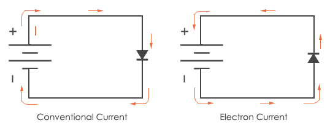
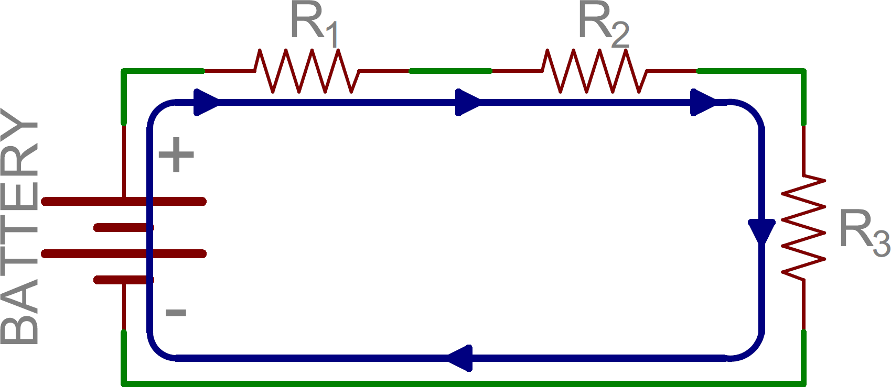
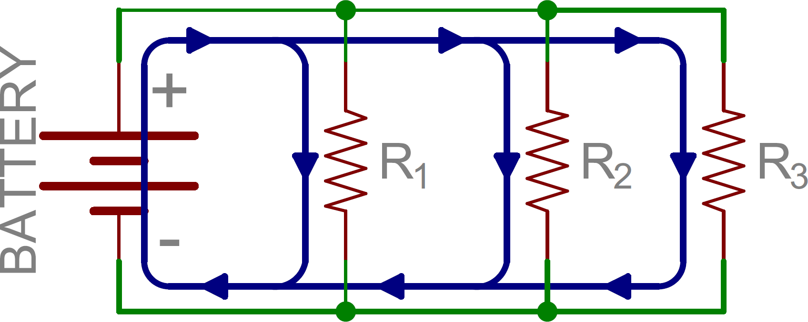
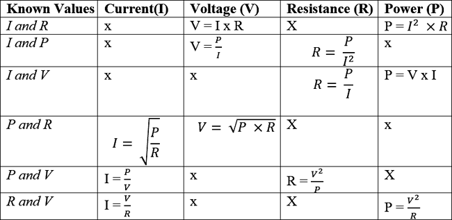

# Basic Electrical Theory

Electricity, in simplest terms, is defined as the movement of charge from positive to negative. Electric current refers to the flow of said charge. This page gives a basic overview of important concepts and formulas relating to electricity.

1. TOC
{:toc}

## Definitions

There are four primary quantities used to describe electricity:

- Voltage, which is defined as "an electromotive force or potential difference expressed in volts." It describes the amount of work per unit charge needed to move a charge from one point to another.
- Current, which refers to the rate at which charge flows through an electric circuit. This is measured in amperes.
- Resistance, which refers to the circuit’s resistance of current flow. This quantity is measured in ohms.
  - Resistors are components used in circuits in order to divide voltage.
- Power, which is defined as the "rate, per unit time, at which electrical energy is transferred by an electric circuit." The SI unit for power is the watt, or one joule/second.

### Types of Electric Current

There are two types of electric current: DC (Direct Current) and AC (Alternating Current). DC flows in only one direction and retains a constant polarity, while AC changes direction and changes polarity. AC is able to carry higher voltages than DC over longer distances.

The only type of current used in FIRST Robotics is DC.

### Conventional Current Flow vs. Electron Flow

Electrons flow from negative to positive in a circuit. This makes sense, since negatively-charged electrons are repelled by the negative terminal and attracted to the positive terminal. However, in electrical theory, what is known as "current" refers to conventional current flow, which describes the movement of a positive charge in the circuit (from positive to negative). This is largely due to the fact that the idea of current flow was conceived before the discovery of the electron.

An image is shown below for clarity.

## Series and Parallel Circuits

There are two types of basic circuits which are important to cover before discussing formulas and their applications.

A series circuit consists of components wired in series, or one after the other, following the power supply. Here is an example of a DC series circuit:

In this image, current moves through three components with known resistance values.

Unlike a series circuit, a parallel circuit consists of branching paths from the power supply. The following is an example of a DC parallel circuit:

It is important to note the differences between each type of circuit with respect to voltage and current: a series circuit will have a consistent current between components and the voltage for each component will vary, while a parallel circuit will have divided current between the branching paths and consistent voltage for each component.

## Formulas 

There are two important formulas for understanding the relationship between voltage, current, resistance, and power.

### Ohm's Law

$$V = I*R$$ 

Where V represents voltage, I represents current, and R represents resistance.

Ohm's Law is the most fundamental electricity law, and can be used to calculate the voltage supplied to a component (assuming the current supplied to the component and the component's resistance are known).

### Joule's Law

$$ P = I * E $$

Where P represents power, I represents current, and E represents voltage. 

When Ohm's Law and Joule's Law are used in conjunction, they can be used to find power, current, voltage, or resistance for the circuit based on what values are known. This is shown in the table below.

## Additional Resources

[Automation Direct - Basic Electrical Theory](https://library.automationdirect.com/basic-electrical-theory/): This is a more detailed overview of the concepts covered on this page. It also features worked examples of Ohm's Law and discusses further laws, such as Kirchhoff's Voltage and Current Laws.

 [PHET - Ohm's Law](https://phet.colorado.edu/en/simulation/ohms-law): This is an interactive simulation of Ohm's Law; the voltage and resistance of a simple circuit can be manipulated to affect current.

[Khan Academy - Ohm's Law](https://www.khanacademy.org/science/ap-physics-1/ap-circuits-topic/current-ap/v/circuits-part-1): This video provides a useful metaphor for describing the concepts of voltage, current, and resistance. It also touches on the history of conventional current flow vs. electron flow.

[Khan Academy - Voltage](https://www.khanacademy.org/science/physics/electric-charge-electric-force-and-voltage/electric-potential-voltage/v/voltage): This video explains the distinction between electric potential energy and electric potential, and provides an example of the math behind voltage.

