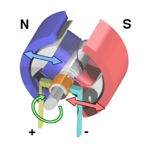
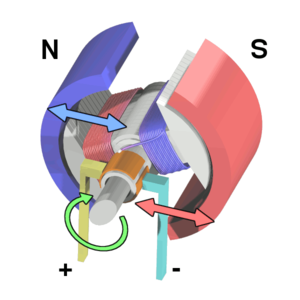
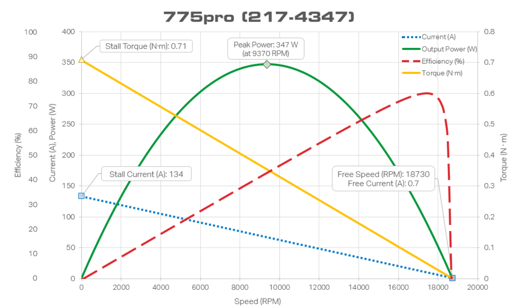

# Brushed DC Motors

Most of the motors available for FRC are brushed DC motors. Using data provided by [Vex](motors.vex.com), it is possible to calculate the current that is required to be applied to any brushed DC motor in order to achieve a certain speed, torque, etc. This article describes brushed DC motors, each DC motor equation, how to use them with Vex motor data, and also demonstrates an application of both: modeling a simple elevator.

 1. TOC
{:toc}

## How Brushed Motors Work

The above diagram displays the major components of a brushed DC motor. A simple, two-pole DC brushed motor works as follows:

1. When the coil is powered, a magnetic field is generated around the armature (i.e. rotor). The interactions between the magnets and the field cause the armature to rotate.

2. When the armature becomes horizontally aligned, the torque becomes zero. In order to counteract this, the commutator reverses the direction of current through the coil, resulting in a reversed magnetic field around the armature. This allows the armature to continue its rotation.

This process repeats itself, resulting in a continuous motion.

## A Simple Motor Model

The image above is a basic model of a DC motor. It shows a resistor and an inductor connected in a series .

The voltage across the motor is the sum of the voltage across the resistor (representing the resistance of the motor itself) and the voltage generated as a result of the magnetic field (back-EMF). In equation form, this appears as:

$$ V = I * R + \omega * K_v$$

Where V represents the voltage across the motor, I represents current in amperes, and R represents resistance in ohms, $$\omega$$ represents the motor's velocity in rotations per minute, and $$K_v$$ represents the voltage-to-velocity constant given the units Volt/RPM.

This formula relates the current applied to a 12VDC brushed motor to its speed.

Another important formula describes motor torque:

$$ \tau = I * K_t $$

Where $$\tau$$ represents torque in newton metres, I represents current in amperes, and $$K_t$$ represents the torque constant. These two equations can be used in tandem to determine how much current must be applied to a DC motor to achieve a certain speed or torque. In order for this to be possible, however, both the $$K_v$$ and $$K_t$$ values for a motor have to be calculated using its motor data.

## Determining $$K_v$$ and $$K_t$$ for a DC Motor

In this section, we will use [Vex motor data](motors.vex.com) to calculate both motor constants. The most commonly used DC motor on Team 401 is the 775pro; thus, we will be using its data sheet for these calculations. When you select the 775pro from the menu, you will find a table and motor curve, both displayed below:

The table shows pertinent data for determining both constants, and the motor curve shows current and torque at specific motor speeds as well as % efficiency (how much of the electrical power is successfully converted to mechanical power).

### $$K_v$$ Calculation

The free speed, free current, and stall current for the 775pro are provided. It is necessary to determine the resistance of the 775pro before finding $$K_v$$, so let's use the stall current to do so.

Since this is a 12VDC motor and the stall current describes the amperage needed to keep the 775pro motor from spinning, the following equation can be set up:

$$12 = 134 * R + 0 * K_v$$ 

This can be easily solved by dividing both sides by 134, resulting in 

$$R = 12/134 =0.090\Omega$$. 

Next, we can use the free speed and the free current values in addition to this value in order to determine the voltage-to-velocity constant for a 775pro motor.

$$12 = 0.7 * 0.090 + 18730 * K_v$$

$$K_v = (12 - 0.7 * 0.090) / 18730 = 4.0 * 10^{-5}$$ Volt/RPM

