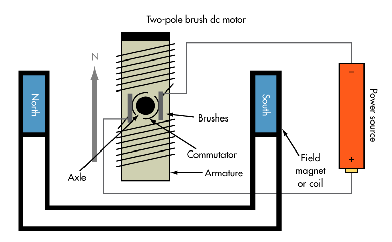

# Brushed DC Motors

Most of the motors available for FRC are brushed DC motors. Using data provided by [Vex](motors.vex.com), it is possible to calculate the current that is required to be applied to any brushed DC motor in order to achieve a certain speed, torque, etc. This article describes brushed DC motors, how each DC motor equation is derived, how to use them with Vex motor data, and also demonstrates an application of both: modeling a simple elevator.

 1. TOC
{:toc}

$$ V = I * R + \omega * K_v$$

$$ \tau = I * K_t $$

these hang out here for now, lol

## How Brushed Motors Work

The above diagram displays the major components of a brushed DC motor: 

## A Simple Motor Model

The image above is a basic diagram of a DC motor. It shows a resistor and an inductor connected in a series circuit.

The voltage across a circuit is the sum of 