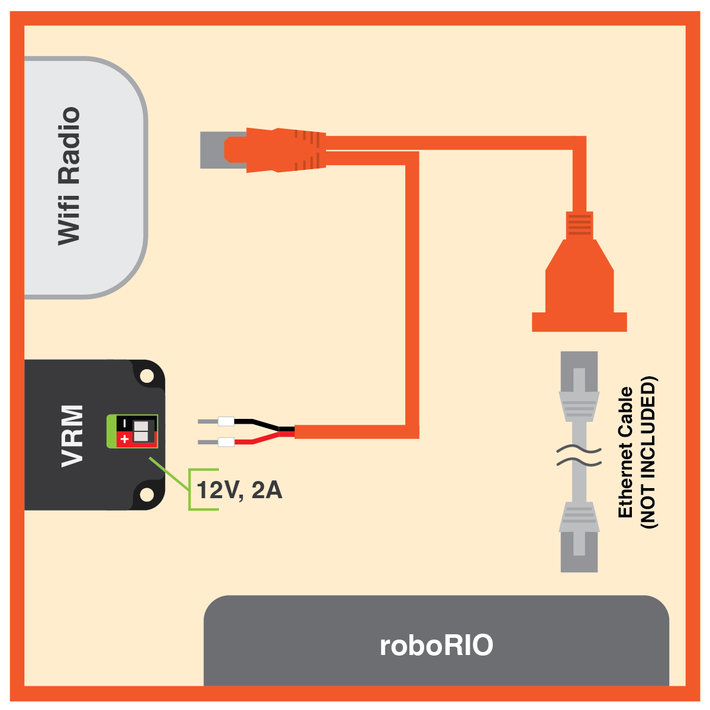

# FRC Component Guide

There are a number of electrical and pneumatic components which are vital to the success of a FRC robot. Thus, it is important to know basic information about each component, each component's function, and how to properly wire these components.

 1. TOC
{:toc}

## roboRIO and Related Components

### roboRIO

The [roboRIO](https://www.andymark.com/products/ni-roborio) is the main controller of every FRC robot. It uses CAN and PWM to provide instructions to motor controllers and components such as the Pneumatic Control Module. The roboRIO can also process inputs from sensors plugged into the DIO, Relay, or Analog ports.

In addition to this, the roboRIO also provides the power for the Robot Signal Light and is connected to the robot router over Ethernet.

More information regarding the roboRIO, including LED indications, can be found in the [user manual](http://www.ni.com/pdf/manuals/374474a.pdf). 

#### Connection Information

| Component                   | Connection                                                   | Appropriate Gauge/Type                                       |
| --------------------------- | ------------------------------------------------------------ | ------------------------------------------------------------ |
| Power Distribution Panel    | roboRIO power input from PDP 10A protected channel           | [18 AWG silicone wire](<https://www.amazon.com/BNTECHGO-Silicone-Flexible-Strands-Stranded/dp/B01KCPL3GC/ref=pd_lpo_vtph_21_tr_img_2/143-1107074-5770767?_encoding=UTF8&psc=1&refRID=JXD50AXF8VPJF8KJP8NW>) |
| Robot Signal Light          | roboRIO power output to signal light from RSL port           | [22 AWG silicone wire](<https://www.amazon.com/BNTECHGO-Silicone-Flexible-Strands-Stranded/dp/B01K4RPE0Y/ref=pd_bxgy_60_img_2/143-1107074-5770767?_encoding=UTF8&pd_rd_i=B01K4RPE0Y&pd_rd_r=577ba9ab-87f5-11e9-b7e3-79e84739181c&pd_rd_w=92jXW&pd_rd_wg=FKFaP&pf_rd_p=a2006322-0bc0-4db9-a08e-d168c18ce6f0&pf_rd_r=KXKCQ5VDMGCA2ZXGJ2B2&psc=1&refRID=KXKCQ5VDMGCA2ZXGJ2B2>) |
| Router                      | Ethernet                                                     | [CAT6 Cable](<https://www.amazon.com/dp/B01CRFVIWO/>)        |
| Pneumatic Control Module    | CAN output to PCM from roboRIO CAN port                      | [CAN Wire](https://www.vexrobotics.com/vexpro/motors-electronics/electricalwire.html) (22 AWG Yellow/Green) |
| Servo                       | PWM output to servo from roboRIO PWM rail                    | 22 AWG 3 pin wire (ribbon cable)                             |
| Banner Photoelectric Sensor | Banner Sensor data output to roboRIO Digital Input/Output (DIO) rail | 22 AWG 3 pin wire (ribbon cable)                             |

#### Wiring Information

##### roboRIO Power

In order to connect the power wires to the roboRIO, use a small flathead screwdriver to loosen the screws on the side of the power input connector (properly known as the [Sauro Connector CTF020V8](https://www.andymark.com/products/sauro-connector-ctf020v8)). These screws are shown in the image below:

The connector above is not labeled as it is on the roboRIO, but it is very important to note that **the red wire MUST go into the port labeled "V"** and that **the black wire MUST go into the port labeled "C".** Strip about ~5/16" of jacketing off each wire, insert the wires into the connector, and then secure the wires by tightening each screw.

An example of a complete power run from the PDP to the roboRIO is shown below.

##### CAN Port

Strip ~5/16" of jacketing off of the yellow and green wires, then use your fingernail or a flathead screwdriver to push down the "buttons" of the Weidmuller terminals. A Weidmuller terminal and a pressed "button" are shown below.

Insert the yellow wire into the terminal marked "YLW" and the green wire into the terminal marked "GRN". After inserting the wires, give them a gentle tug to verify that the connection is secure.

If you are using ferrules, insert each stripped wire into each ferrule and then crimp the ferrules using the appropriate crimping tool. The [white ferrules](<http://www.ctr-electronics.com/ferrule-18-awg.html>) are intended for **18 AWG wire**; thus, it is important to **strip twice as much wire and then fold the exposed wire in half in order to double its effective wire radius.** After the ferrules have been crimped and they have been tug tested, push the two wires into their respective terminals. No "button" pushing is required for this.

##### PWM and Other 3 Pin Ports

An appropriate cable for plugging into the roboRIO's PWM, DIO, Relay, and Analog ports is created as follows:

1. Cut a segment that is three wires wide from a ribbon cable. Be sure to measure the segment with respect to where your components are.
2. Strip ~1/8" of jacketing off of each wire in the segment.
3. Crimp a [22 AWG socket contact](<https://www.digikey.com/product-detail/en/molex-llc/0016020086/WM2510CT-ND/467802>) onto each wire. Before crimping, ensure that the exposed wire is set in the front set of teeth and that the insulated wire is set in the back set of teeth.
4. Insert each of the crimped wires into a [Male 3 Pin Locking Housing](https://www.digikey.com/product-detail/en/molex-llc/50-57-9403/WM2901-ND/115034). Each contact makes an audible click when inserted properly. If you are having trouble, try using a small flathead screwdriver to push contacts into the housing. It may also help to bend up the tabs on each socket contact. Test each insertion by tugging on each wire.
5. Plug the housing into the desired port on the roboRIO.

There are certain cases in which only one wire is required to be plugged into a roboRIO port (e.g. the two data wires from a Banner sensor are typically plugged into separate DIO ports). In these situations, it is recommended that additional uncrimped socket contacts are placed into the housing to prevent the housing from coming unplugged.

##### RSL Port

In order to create a cable which can plug into the RSL port on the roboRIO, a [Male 2 Pin Locking Housing](https://www.digikey.com/product-detail/en/molex-llc/50-57-9402/WM2900-ND/115029) must be used. The steps for crimping and inserting socket contacts into this type of housing are practically identical to the steps listed in the section above, except for the fact that 22 AWG silicone wire is used instead of ribbon cable. Additionally, the black power wire should be inserted into the side of the locking housing marked with an arrow.

### Robot Router

The [robot router](https://www.andymark.com/products/open-mesh-om5p-ac-dual-band-1-17-gbps-access-point-radio) uses WiFi to facilitate communication between the roboRIO and the driver station. Its LED indications are displayed in the graphic below:

For information regarding the configuration of a robot router, visit the [WPI guide](http://wpilib.screenstepslive.com/s/4485/m/13503/l/144986?data-resolve-url=true&data-manual-id=13503).

#### Connection Information

| Component                 | Connection                                                   | Appropriate Gauge/Type                                       |
| ------------------------- | ------------------------------------------------------------ | ------------------------------------------------------------ |
| roboRIO                   | Ethernet through POE injector or directly from roboRIO into 18-24vPOE port | [CAT6 Cable](<https://www.amazon.com/dp/B01CRFVIWO/>)        |
| Voltage Regulation Module | Power through the POE injector or directly from the VRM (into barrel jack) | [18 AWG silicone wire](<https://www.amazon.com/BNTECHGO-Silicone-Flexible-Strands-Stranded/dp/B01KCPL3GC/ref=pd_lpo_vtph_21_tr_img_2/143-1107074-5770767?_encoding=UTF8&psc=1&refRID=JXD50AXF8VPJF8KJP8NW>) for direct connection or POE injector |
| Ethernet Switch           | Ethernet from 802.3af port                                   | [CAT6 Cable](<https://www.amazon.com/dp/B01CRFVIWO/>)        |

#### Wiring Information

##### POE Injector

The POE injector is typically used to provide power to a FRC router. It is very important to note that **the male end of the POE injector should never be plugged into the roboRIO**; a separate Ethernet cable coming from the roboRIO's Ethernet port is required and should be plugged into the female end of the POE injector. The injector's male end plugs into the 18-24vPOE port.

The power wires branching off of the male end of the POE injector plug into the VRM's 12V/2A terminals. Power to the radio is the only acceptable load which can be connected to the 12V/2A terminals, as is stated in the FRC game manual. **Make sure that the power wires are connected to the VRM with the proper polarity.**

A diagram showing the proper way to wire a POE injector is shown below.

### Robot Signal Light

The Robot Signal Light is a mandatory safety feature of every FRC robot. As such, it is important that it is easy to see and that it is wired correctly. A solid RSL indicates that a robot is powered on and disabled, while a blinking RSL indicates that the robot is enabled.

#### Connection Information

| Component | Connection                        | Appropriate Gauge/Type                                       |
| --------- | --------------------------------- | ------------------------------------------------------------ |
| roboRIO   | Power input from roboRIO RSL port | [22 AWG silicone wire](<https://www.amazon.com/BNTECHGO-Silicone-Flexible-Strands-Stranded/dp/B01K4RPE0Y/ref=pd_bxgy_60_img_2/143-1107074-5770767?_encoding=UTF8&pd_rd_i=B01K4RPE0Y&pd_rd_r=577ba9ab-87f5-11e9-b7e3-79e84739181c&pd_rd_w=92jXW&pd_rd_wg=FKFaP&pf_rd_p=a2006322-0bc0-4db9-a08e-d168c18ce6f0&pf_rd_r=KXKCQ5VDMGCA2ZXGJ2B2&psc=1&refRID=KXKCQ5VDMGCA2ZXGJ2B2>) |

#### Wiring Information

As can be seen in the above diagram, the RSL requires a jumper wire from the "La" terminal to the "Lb" terminal. The steps to wiring a RSL are as follows:

1. Measure and cut black and red 22 AWG wires of equal length. These measurements should be made with respect to where the roboRIO and RSL are located on the robot.
2. Strip ~5/16" of jacketing from the black wire. Insert the stripped end into the terminal marked "N" and use a small flathead screwdriver to tighten the terminal.
3. Strip ~5/16" of jacketing from the red wire. Insert the stripped end into the terminal marked "La." Tighten the terminal, but not entirely.
4. Cut a small piece of red 22 AWG wire. Strip both ends, then insert one end into the "La" terminal and tighten.
5. Insert the other end of the jumper into the terminal marked "Lb." Tighten the terminal.
6. Strip the other end of each long wire and crimp a socket contact onto each one, then insert both into a Male 2 Pin Locking Housing. The procedure for this can be found in the RSL section of the roboRIO wiring information.

A completely wired RSL is shown in the image below.

### Limelight 2

### Photoelectric Sensor

### Ethernet Switch

### RIOduino/LED Strip

## Power Distribution and Regulation

### Power Distribution Panel

### Voltage Regulation Module

### 120A Circuit Breaker

### 12V Lead Acid Battery

## Motor Control

### Talon SRX

### Victor SPX

### REV SPARKMAX

### Magnetic Encoder

### Pigeon IMU

## Motors/Servos

### 775pro

### REV NEO

### CIM

### miniCIM

### Servo

## Pneumatics

### Pneumatic Control Module

### Solenoids/Manifold

### Compressor

### Cylinders

### Tank

### Pressure Transducer

