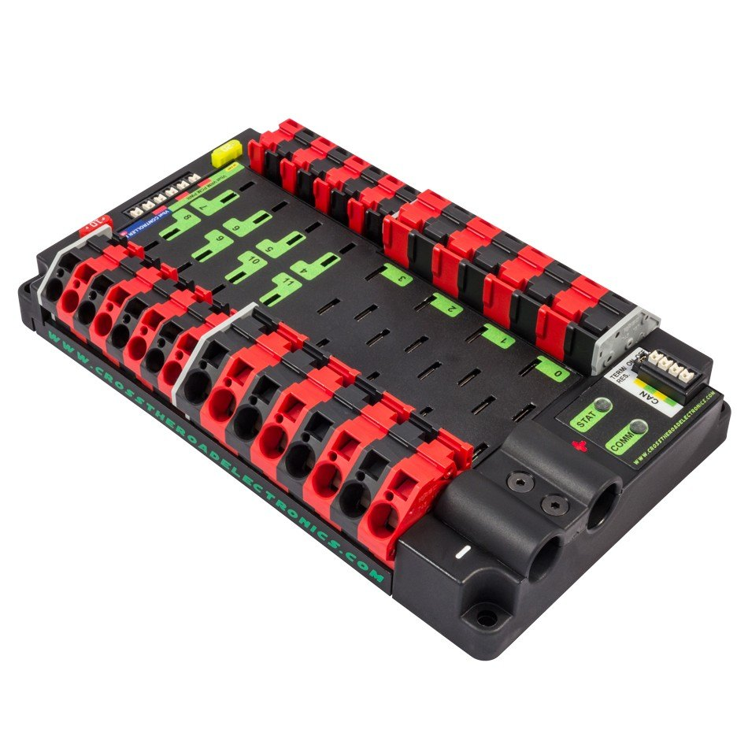
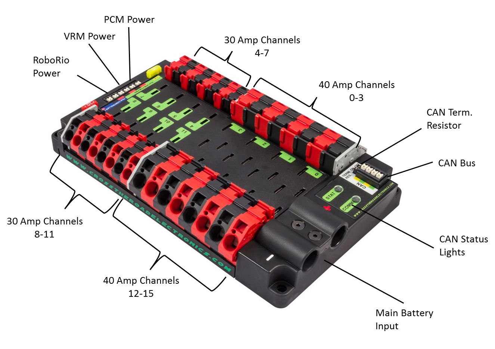

# Power Distribution and Regulation

 1. TOC
{:toc}

## Power Distribution Panel

The [Power Distribution Panel](https://www.andymark.com/products/power-distribution-panel) (PDP) distributes 12V power from the lead acid battery to almost every component on a FRC robot. The Power Distribution Panel has multiple channels at different amperages (10A, 20A, 30A, 40A).

### Connection Information

| Component                    | Connection                             | Channel/Port                                                 | Appropriate Gauge/Type |
| ---------------------------- | -------------------------------------- | ------------------------------------------------------------ | ---------------------- |
| 12V Lead Acid Battery        | PDP power input (-/GND)                | Main Battery Input (-)                                       | 6 AWG wire, black      |
| 120A Circuit Breaker         | PDP power input (+/POS)                | Main Battery Input (+)                                       | 6 AWG wire, red        |
| roboRIO                      | Power output to roboRIO                | roboRIO Power, 10A protected channel                         | 18 AWG wire            |
| Voltage Regulation Module    | Power output to VRM                    | VRM Power, 20A protected channel                             | 18 AWG wire            |
| Pneumatic Control Module     | Power output to PCM                    | PCM Power, 20A protected channel                             | 18 AWG wire            |
| DC-DC Converter              | Power output to DC-DC Converter        | 30A channels (4-7, 8-11) with a 20A circuit breaker          | 18 AWG wire            |
| SPARK MAX motor controllers  | Power output to SPARK MAX controllers  | 40A channels (0-3, 12-15)                                    | 12 AWG wire            |
| Talon SRX motor controllers  | Power output to Talon SRX controllers  | Either 30A channels (4-7, 8-11) or 40A channels (0-3, 12-15), depending on controller application | 12 AWG wire            |
| Victor SPX motor controllers | Power output to Victor SPX controllers | Typically 30A channels (4-7, 8-11)                           | 12 AWG wire            |

## Voltage Regulation Module

## 120A Circuit Breaker

## 12V Lead Acid Battery

## DC-DC Converter

