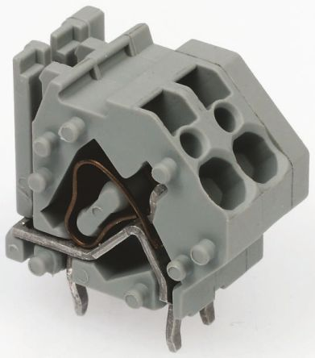

# Power Distribution and Regulation

 1. TOC
{:toc}

## Power Distribution Panel

The [Power Distribution Panel](https://www.andymark.com/products/power-distribution-panel) (PDP) distributes 12V power from the lead acid battery to almost every component on a FRC robot. The Power Distribution Panel has multiple channels at different amperages (10A, 20A, 30A, 40A).

### Connection Information

| Component                             | Connection                             | Channel/Port                                                 | Appropriate Gauge/Type                                       |
| ------------------------------------- | -------------------------------------- | ------------------------------------------------------------ | ------------------------------------------------------------ |
| 12V Lead Acid Battery                 | PDP power input (-/GND)                | Main Battery Input (-)                                       | [6 AWG wire, black](https://www.mcmaster.com/6948k91)        |
| 120A Circuit Breaker                  | PDP power input (+/POS)                | Main Battery Input (+)                                       | 6 AWG wire, red                                              |
| roboRIO                               | Power output to roboRIO                | roboRIO Power, 10A protected channel                         | [18 AWG silicone wire](https://www.amazon.com/BNTECHGO-Silicone-Flexible-Strands-Stranded/dp/B01KCPL3GC/ref=pd_lpo_vtph_21_tr_img_2/143-1107074-5770767?_encoding=UTF8&psc=1&refRID=JXD50AXF8VPJF8KJP8NW) |
| Voltage Regulation Module             | Power output to VRM                    | VRM Power, 20A protected channel                             | 18 AWG silicone wire                                         |
| Pneumatic Control Module              | Power output to PCM                    | PCM Power, 20A protected channel                             | 18 AWG silicone wire                                         |
| DC-DC Converter                       | Power output to DC-DC Converter        | 30A channels (4-7, 8-11) with a 20A circuit breaker          | 18 AWG silicone wire                                         |
| SPARK MAX motor controllers           | Power output to SPARK MAX controllers  | 40A channels (0-3, 12-15)                                    | [12 AWG silicone wire](https://www.vexrobotics.com/vexpro/motors-electronics/electricalwire.html) |
| Talon SRX motor controllers           | Power output to Talon SRX controllers  | Either 30A channels (4-7, 8-11) or 40A channels (0-3, 12-15), depending on controller application | 12 AWG silicone wire                                         |
| Victor SPX motor controllers          | Power output to Victor SPX controllers | Typically 30A channels (4-7, 8-11)                           | 12 AWG silicone wire                                         |
| Last motor controller in CAN sequence | CAN terminates in PDP                  | One CAN terminal pair                                        | [CAN wire (22 AWG Yellow/Green)](https://www.vexrobotics.com/vexpro/motors-electronics/electricalwire.html) |

### Wiring Information

#### WAGO Connectors

The 30A and 40A channels on the PDP are each composed of one red and one black 745 series WAGO connector (an example of which is pictured above). The steps for inserting a wire into one of these WAGO connectors are as follows:

1. Strip approximately 5/16" of jacketing off the end of the 12 AWG wire to be inserted into the WAGO connector, then twist the exposed wire contacts clockwise.
2. Insert a small flathead screwdriver or [WAGO tool](https://firstchoicebyandymark.com/fc-wagotool) at a shallow angle into the rectangular hole of the connector.
3. Angle the tool further upward as you push the tool in to actuate the lever and open the terminal. If done properly, it is possible to leave the tool in place and keep the terminal open.
4. Insert the wire into the terminal, then remove the tool. You should be unable to pull the wire out of the WAGO connector.

#### Breakers and Fuses

Examples of the proper orientation and location of PDP breakers and fuses are displayed in the two images below:

In this image, four 40A breakers have been plugged into four of the PDP's 40A channels (channels 2, 3, 12, and 13). As is shown, each breaker corresponds with the nearest positive terminal.

## 120A Circuit Breaker

## Voltage Regulation Module

## 12V Lead Acid Battery

## DC-DC Converter

