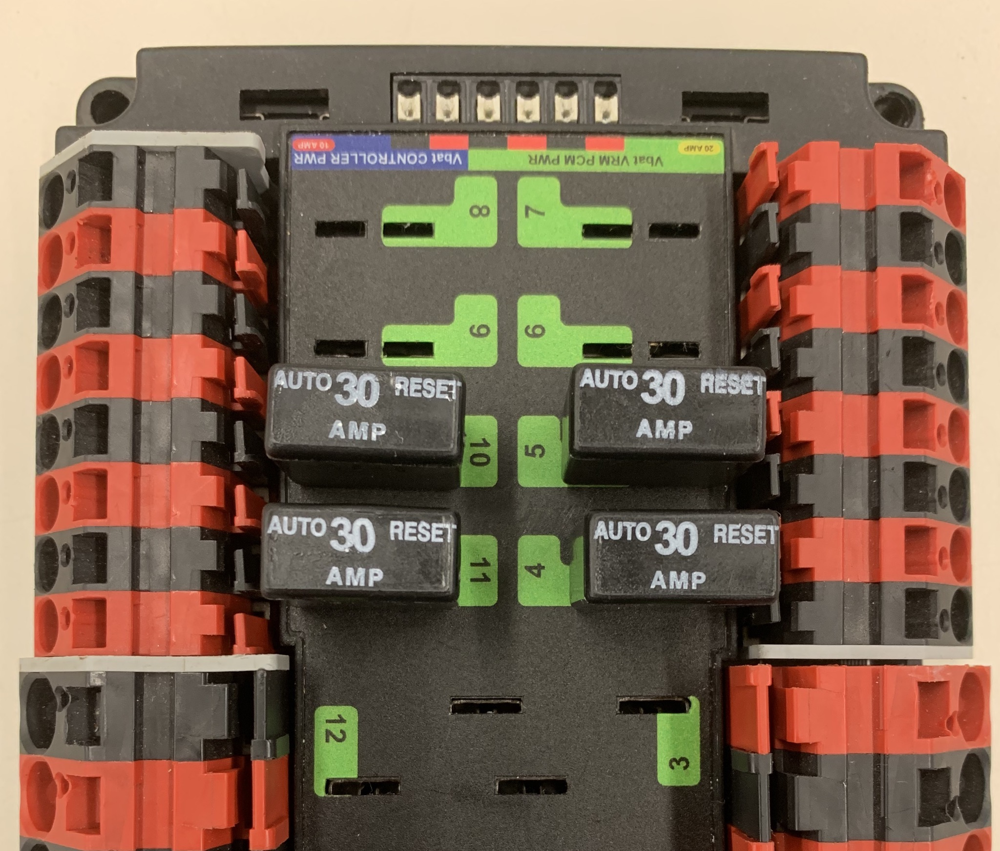
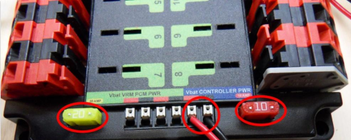
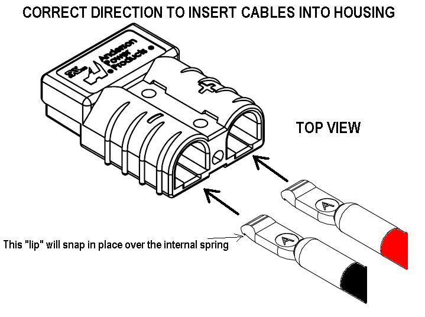
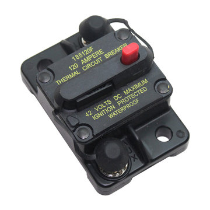
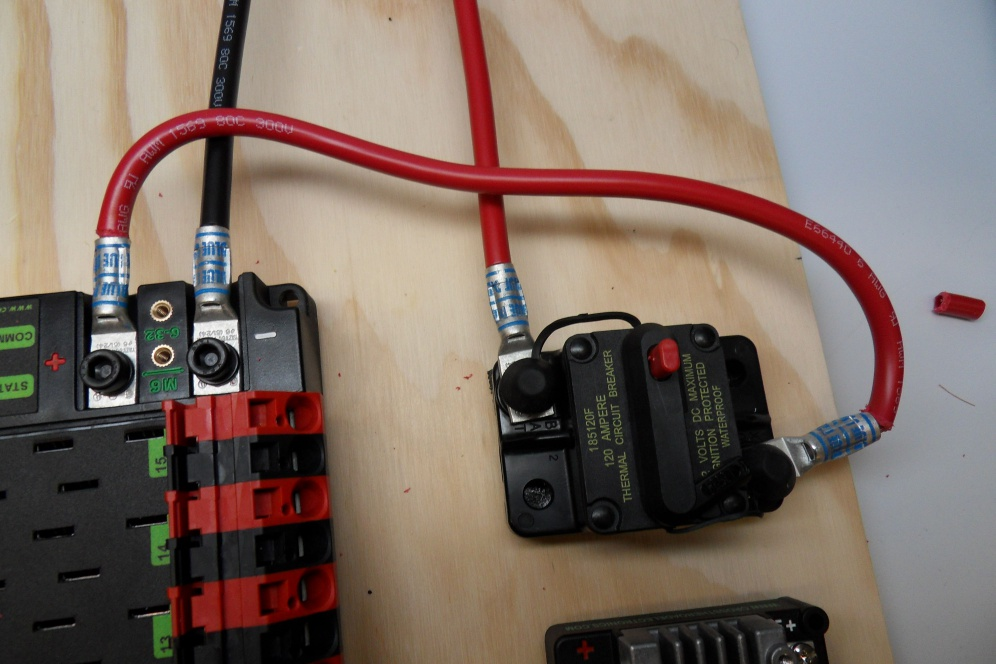

# Power Distribution and Regulation

 1. TOC
{:toc}

## Power Distribution Panel

The [Power Distribution Panel](https://www.andymark.com/products/power-distribution-panel) (PDP) distributes 12V power from the lead acid battery to almost every component on a FRC robot. The Power Distribution Panel has multiple channels at different amperages (10A, 20A, 30A, 40A).

### Connection Information

| Component                             | Connection                             | Channel/Port                                                 | Appropriate Gauge/Type                                       |
| ------------------------------------- | -------------------------------------- | ------------------------------------------------------------ | ------------------------------------------------------------ |
| Robot Battery                         | PDP power input (-/GND)                | Main Battery Input (-)                                       | [6 AWG wire, black](https://www.mcmaster.com/6948k91)        |
| 120A Circuit Breaker                  | PDP power input (+/POS)                | Main Battery Input (+)                                       | 6 AWG wire, red                                              |
| roboRIO                               | Power output to roboRIO                | roboRIO Power, 10A protected channel                         | [18 AWG silicone wire](https://www.amazon.com/BNTECHGO-Silicone-Flexible-Strands-Stranded/dp/B01KCPL3GC/ref=pd_lpo_vtph_21_tr_img_2/143-1107074-5770767?_encoding=UTF8&psc=1&refRID=JXD50AXF8VPJF8KJP8NW) |
| Voltage Regulation Module             | Power output to VRM                    | VRM Power, 20A protected channel                             | 18 AWG silicone wire                                         |
| Pneumatic Control Module              | Power output to PCM                    | PCM Power, 20A protected channel                             | 18 AWG silicone wire                                         |
| DC-DC Converter                       | Power output to DC-DC Converter        | 30A channels (4-7, 8-11) with a 20A circuit breaker          | 18 AWG silicone wire                                         |
| SPARK MAX motor controllers           | Power output to SPARK MAX controllers  | 40A channels (0-3, 12-15)                                    | [12 AWG silicone wire](https://www.vexrobotics.com/vexpro/motors-electronics/electricalwire.html) |
| Talon SRX motor controllers           | Power output to Talon SRX controllers  | Either 30A channels (4-7, 8-11) or 40A channels (0-3, 12-15), depending on controller application | 12 AWG silicone wire                                         |
| Victor SPX motor controllers          | Power output to Victor SPX controllers | Typically 30A channels (4-7, 8-11)                           | 12 AWG silicone wire                                         |
| Last motor controller in CAN sequence | CAN terminates in PDP                  | One CAN terminal pair                                        | [CAN wire (22 AWG Yellow/Green)](https://www.vexrobotics.com/vexpro/motors-electronics/electricalwire.html) |

### Wiring Information

#### WAGO Connectors

##### Tools Required

* Flathead screwdriver or [WAGO tool](https://firstchoicebyandymark.com/fc-wagotool)
* Wire strippers

##### Materials Required

* [12 AWG silicone wire](https://www.vexrobotics.com/vexpro/motors-electronics/electricalwire.html)

##### Instructions

The 30A and 40A channels on the PDP are each composed of one red and one black 745 series WAGO connector (an example of which is pictured above). The steps for inserting a wire into one of these WAGO connectors are as follows:

1. Measure and cut a segment of [12 AWG silicone wire](https://www.vexrobotics.com/vexpro/motors-electronics/electricalwire.html). Be sure to measure the segment with respect to component location.
2. Strip approximately 5/16" of jacketing off the end of the 12 AWG wire to be inserted into the WAGO connector, then twist the exposed wire contacts clockwise.
3. Insert a small flathead screwdriver or [WAGO tool](https://firstchoicebyandymark.com/fc-wagotool) at a shallow angle into the rectangular hole of the connector.
4. Angle the tool further upward as you push the tool in to actuate the lever and open the terminal. If done properly, it is possible to leave the tool in place and keep the terminal open.
5. Insert the wire into the terminal, then remove the tool. You should be unable to pull the wire out of the WAGO connector.

#### Breakers and Fuses

Circuit breakers and fuses protect components of a FRC robot from drawing too much current due to short circuits or other similar issues. Both are both tripped by excess heat (a result of excess current), and fuses are only usable once while breakers can be reset.

Examples of the proper orientation and location of PDP breakers and fuses are displayed in the two images below:

In this image, four 40A breakers have been plugged into four of the PDP's 40A channels (channels 2, 3, 12, and 13). As is shown, each breaker corresponds with the nearest positive terminal.

30A breakers plugged into channels 4, 5, 10, and 11 are displayed in the image above. 20A breakers can also be plugged into the 30A channels, but **not in the 40A channels.**

The orientation for these breakers does not matter as long as they all fit properly.

As for fuses, the 10A and 20A fuses in their proper PDP locations are pictured below:

**Make sure that both breakers and fuses are pushed all the way into the PDP. It should be very difficult to remove the 10A and 20A fuses without a screwdriver or similar tool.**

#### CAN

Team 401 terminates its CAN BUS in the PDP; in other words, it is the last component that should be wired into the CAN sequence because it has a terminating resistor. In order to do so, strip ~5/16" of jacketing off of the yellow and green wires, then use your fingernail or a flathead screwdriver to push down the "buttons" of the Weidmuller terminals. A Weidmuller terminal and a pressed "button" are shown below.

If you decide to use ferrules, insert each stripped wire into each ferrule and then crimp the ferrules using the appropriate crimping tool. The [white ferrules](<http://www.ctr-electronics.com/ferrule-18-awg.html>) are intended for **18 AWG wire**; thus, it is important to **strip twice as much wire and then fold the exposed wire in half in order to double its effective wire radius.** After the ferrules have been crimped and they have been tug tested, push the two wires into their respective terminals. No "button" pushing is required for this.

#### roboRIO, VRM, and PCM Power

The roboRIO, VRM, and PCM power channels on the PDP also use Weidmuller terminals. The instructions are essentially the same as those for the CAN Weidmullers, except for the fact that the power wires going to the PCM, VRM and roboRIO are **18 AWG. **This means that you can strip ~5/16" of jacketing off each power wire and insert them directly into the PDP, or use ferrules.

#### Battery Connector to PDP Ground

##### Tools Required

- Shears / cutters
- Wire snips
- Scissors
- [Y1MRTC Crimping Tool](https://www.hubbell.com/burndy/en/Products/Power-Utilities/Tools-Dies-Accessories/Mechanical/Y1MRTC/p/1649118)
- Heat gun
- 7/16" box end wrench
- 1/16" Allen wrench
- 5 mm Allen wrench (3/16" wrench acceptable)

##### Materials Required

- [APP SB50 Housing](https://powerwerx.com/992g1-bk-anderson-power-red) (mounted on robot)
- Black [6 AWG wire](https://www.mcmaster.com/6948k91)
- 1 x [SB50 Powerpole Contact](https://powerwerx.com/5900-bk-anderson-power-6awg)
- 1 x [Compression Lug Connector](https://www.andymark.com/products/compression-lug-connector-6-gauge-1-4-stud-hole-burndy-yazv6ctc14fx) 
- Heat shrink

##### Heat Gun Safety

Heat guns are commonly used tools in Electrical due to how often heat shrink is required. Since this tool is used frequently, it is important to understand the following safety tips:

1. Do not point the heat gun at yourself or others while it is on. Although it resembles a hair dryer, it is most certainly not.
2. After using the heat gun, set it down on a table and ensure that it does not rest on any wires or other materials. There have been instances of wires and cables having their insulation melted, which presents another safety risk.
3. Avoid touching the heat gun after use. It will still be hot to the touch and can burn you.

##### Instructions

Before following these steps, ensure that a [APP SB50 Housing](https://powerwerx.com/992g1-bk-anderson-power-red) is properly mounted to the robot; it should be located near the battery and oriented such that a battery can be easily plugged in. Keep wiring routes in mind when choosing a location.

To create a connection between the SB50 housing and the PDP ground terminal:

1. Measure and cut a piece of black [6 AWG wire](https://www.mcmaster.com/6948k91). Cutting a wire of this gauge can be best accomplished with shears or similar cutters.
2. Strip one end of the wire by using a pair of snips to cut off the jacketing. Expose enough wire to fill a [SB50 Powerpole Contact](https://powerwerx.com/5900-bk-anderson-power-6awg). 
3. Insert the wire into a SB50 Powerpole Contact.
4. Using the [Y1MRTC Crimping Tool](https://www.hubbell.com/burndy/en/Products/Power-Utilities/Tools-Dies-Accessories/Mechanical/Y1MRTC/p/1649118) with its die rotated to "Blue," crimp the SB50 as close as possible to its base. Then move the tool and crimp the contact again.
5. Ensure that the contact is properly crimped, and then insert the wire into the SB50 Housing as shown below.

6. Strip the remaining end of the wire. Expose enough wire to fill a [Compression Lug Connector](https://www.andymark.com/products/compression-lug-connector-6-gauge-1-4-stud-hole-burndy-yazv6ctc14fx).
7. Insert the wire into a Compression Lug Connector.
8. Using the [Y1MRTC Crimping Tool](https://www.hubbell.com/burndy/en/Products/Power-Utilities/Tools-Dies-Accessories/Mechanical/Y1MRTC/p/1649118) with its die rotated to "Blue," crimp the Lug Connector as close as possible to its base. Then move the tool and crimp the contact again.
9. Use scissors to cut a piece of heat shrink large enough to cover the exposed metal of the Lug Connector, push the heat shrink onto the connector, and then use the heat gun.
10. Use a 1/16" Allen wrench to remove the two screws securing the cover of the PDP battery terminals.
11. Use a 5 mm Allen wrench (3/16" wrench acceptable) and remove the bolt and washer on the negative (-) terminal. Fasten the Lug Connector.

## 120A Circuit Breaker

The 120A circuit breaker serves as a main power switch for all FRC robots, and protects them from drawing too much current (thus tripping the breaker). This circuit breaker should be securely mounted to a rigid part of the robot and should be easy to see and reach in case of an emergency.

### Connection Information

| Component                | Connection                | Channel/Port            | Appropriate Gauge/Type                              |
| ------------------------ | ------------------------- | ----------------------- | --------------------------------------------------- |
| Robot Battery            | Robot power input (+/POS) | BAT Terminal            | [6 AWG wire, red](https://www.mcmaster.com/6948k91) |
| Power Distribution Panel | PDP power input (+/POS)   | AUX Terminal (pictured) | 6 AWG wire, red                                     |

### Wiring Information

#### Battery Connector to 120A Circuit Breaker

##### Tools Required

* Shears / cutters
* Wire snips
* Scissors
* [Y1MRTC Crimping Tool](https://www.hubbell.com/burndy/en/Products/Power-Utilities/Tools-Dies-Accessories/Mechanical/Y1MRTC/p/1649118)
* Heat gun
* 7/16" box end wrench

##### Materials Required

* [APP SB50 Housing](https://powerwerx.com/992g1-bk-anderson-power-red) (mounted on robot)
* Red [6 AWG wire](https://www.mcmaster.com/6948k91)
* 1 x [SB50 Powerpole Contact](https://powerwerx.com/5900-bk-anderson-power-6awg)
* 1 x [Compression Lug Connector](https://www.andymark.com/products/compression-lug-connector-6-gauge-1-4-stud-hole-burndy-yazv6ctc14fx) 
* Heat shrink

##### Instructions

Before following these steps, ensure that a [APP SB50 Housing](https://powerwerx.com/992g1-bk-anderson-power-red) is properly mounted to the robot; it should be located near the battery and oriented such that a battery can be easily plugged in. Keep wiring routes in mind when choosing a location.

To create a connection between the SB50 Housing and the 120A breaker:

1. Measure and cut a piece of red [6 AWG wire](https://www.mcmaster.com/6948k91). Cutting a wire of this gauge can be best accomplished with shears or similar cutters.

2. Strip one end of the wire by using a pair of snips to cut off the jacketing. Expose enough wire to fill a [SB50 Powerpole Contact](https://powerwerx.com/5900-bk-anderson-power-6awg). 

3. Insert the wire into a SB50 Powerpole Contact.

4. Using the [Y1MRTC Crimping Tool](https://www.hubbell.com/burndy/en/Products/Power-Utilities/Tools-Dies-Accessories/Mechanical/Y1MRTC/p/1649118) with its die rotated to "Blue," crimp the SB50 as close as possible to its base. Then move the tool and crimp the contact again. The contact should resemble what is shown in the image below.

5. Ensure that the contact is properly crimped, and then insert the wire into the positive (+) part SB50 Housing as shown below.

6. Strip the remaining end of the wire. Expose enough wire to fill a [Compression Lug Connector](https://www.andymark.com/products/compression-lug-connector-6-gauge-1-4-stud-hole-burndy-yazv6ctc14fx).
7. Insert the wire into a Compression Lug Connector.
8. Using the [Y1MRTC Crimping Tool](https://www.hubbell.com/burndy/en/Products/Power-Utilities/Tools-Dies-Accessories/Mechanical/Y1MRTC/p/1649118) with its die rotated to "Blue," crimp the Lug Connector as close as possible to its base. Then move the tool and crimp the contact again.
9. Use scissors to cut a piece of heat shrink large enough to cover the exposed metal of the Lug Connector, push the heat shrink onto the connector, and then use the heat gun.
10. Cut a piece of heat shrink in order to cover the exposed metal of the Lug Connector. Use the heat gun to keep it in place.
11. Use a 7/16" box end wrench to remove the nut on the 120A Circuit Breaker's BAT terminal. Fasten the Lug Connector; a sufficiently secured wire will be immovable.

#### 120A Circuit Breaker to PDP Positive

##### Tools Required

- Shears / cutters
- Wire snips
- Scissors
- [Y1MRTC Crimping Tool](https://www.hubbell.com/burndy/en/Products/Power-Utilities/Tools-Dies-Accessories/Mechanical/Y1MRTC/p/1649118)
- Heat gun
- 7/16" box end wrench
- 1/16" Allen wrench
- 5 mm Allen wrench (3/16" wrench acceptable)

##### Materials Required

- Red [6 AWG wire](https://www.mcmaster.com/6948k91)
- 2 x [Compression Lug Connector](https://www.andymark.com/products/compression-lug-connector-6-gauge-1-4-stud-hole-burndy-yazv6ctc14fx) 
- Heat shrink

##### Instructions

1. Measure and cut a piece of red [6 AWG wire](https://www.mcmaster.com/6948k91). Cutting a wire of this gauge can be best accomplished with shears or similar cutters.
2. Strip one end of the wire by using a pair of snips to cut off the jacketing. Expose enough wire to fill a [Compression Lug Connector](https://www.andymark.com/products/compression-lug-connector-6-gauge-1-4-stud-hole-burndy-yazv6ctc14fx).
3. Insert the wire into a Compression Lug Connector.
4. Using the [Y1MRTC Crimping Tool](https://www.hubbell.com/burndy/en/Products/Power-Utilities/Tools-Dies-Accessories/Mechanical/Y1MRTC/p/1649118) with its die rotated to "Blue," crimp the Lug Connector as close as possible to its base. Then move the tool and crimp the contact again.
5. Use scissors to cut a piece of heat shrink large enough to cover the exposed metal of the Lug Connector, push the heat shrink onto the connector, and then use the heat gun.
6. Use a 7/16" box end wrench to remove the nut on the 120A Circuit Breaker's AUX terminal. Fasten the Lug Connector; a sufficiently secured wire will be immovable.
7. Strip the remaining end of the wire. Expose enough wire to fill another Compression Lug Connector.
8. Add heat shrink to cover the exposed metal of the connector, as in step #5.
9. Insert the wire into the connector.
10. Using the [Y1MRTC Crimping Tool](https://www.hubbell.com/burndy/en/Products/Power-Utilities/Tools-Dies-Accessories/Mechanical/Y1MRTC/p/1649118) with its die rotated to "Blue," crimp the Lug Connector as close as possible to its base. Then move the tool and crimp the contact again.
11. Use a 1/16" Allen wrench to remove the two screws securing the cover of the PDP battery terminals, if they have not been removed already.
12. Use a 5 mm Allen wrench (3/16" wrench acceptable) and remove the bolt and washer on the negative (-) terminal. Fasten the Lug Connector.

The following picture shows an example of a fully wired 120A Circuit Breaker and PDP Main Battery Input (albeit with no heat shrink):

## Voltage Regulation Module

## Robot Battery

## DC-DC Converter

