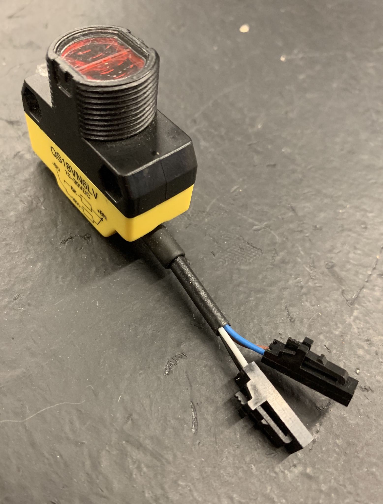
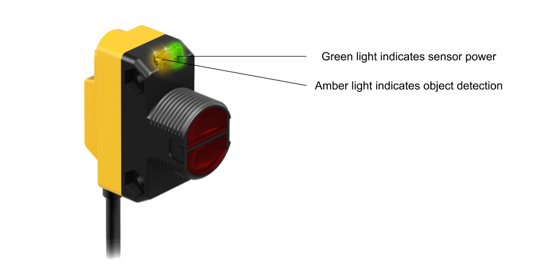

# Sensors

 1. TOC
{:toc}

## CTRE Mag Encoder

## CTRE Pigeon IMU

## Photoelectric Sensor

Photoelectric sensors are incredibly useful for detecting game pieces and are thus often used with the team's intake mechanisms. This team typically uses the Banner brand.

There are two types of Banner sensors used by the team: Diffuse and Retroreflective. The Diffuse sensor (QS18VN6D) transmits infrared light which strikes an object; this light is then reflected off of the target and is registered by the built-in receiver, allowing the sensor to detect an object. This type of sensor is only effective over short distances due to the angles at which the light is reflected off of a target.

The Retroreflective sensor (QS18VN6LV), also known as the beam break, uses light reflected off of a piece of retroreflective tape to detect if an object has come between the sensor and the tape.

### Connection Information

| Component                 | Connection                                                   | Port/Channel | Appropriate Gauge/Type           |
| ------------------------- | ------------------------------------------------------------ | ------------ | -------------------------------- |
| Voltage Regulation Module | 12V/500mA power from VRM into brown and blue Banner wires, where brown is ground | N/A          | 22 AWG 2 pin wire (ribbon cable) |
| roboRIO                   | Black and white Banner wires into DIO ports (wiring depends on sensor purpose) | N/A          | 22 AWG 2 pin wire (ribbon cable) |

### Wiring Information

#### Sensor Power

Ideally, every Banner sensor found in the stock room already has its blue and brown power wires in a [Male 2 Pin Locking Housing](https://www.digikey.com/product-detail/en/molex-llc/50-57-9402/WM2900-ND/115029), with the blue wire on the arrow. This is shown above. The steps for making a power run from the VRM to a banner sensor are given below:

1. Cut a segment of ribbon cable that is two wires wide. Make sure that the segment is an appropriate length. If possible, choose appropriate wire colors (i.e. pick a ribbon cable segment containing a brown or blue wire).
2. Strip ~1/8" of jacketing from one end of both wires. Crimp a [22 AWG pin contact](https://www.digikey.com/product-detail/en/molex-llc/0016020107/WM2517CT-ND/467804) onto each wire and then place each crimped wire into a [Female 2 Pin Locking Housing](https://www.digikey.com/product-detail/en/molex-llc/0701070001/WM2533-ND/210968). If one of the Banner wires is the same color as a segment wire, it is preferred that the wires match when the cable is plugged in. Note which wire in the cable is ground (i.e. which wire is connected to the sensor's brown power wire).
3. Strip ~5/16" of jacketing from the other end of both wires. Then, plug the wires into one of the VRM's 12V/500mA terminal pairs.

#### Sensor Data

As with sensor power, the data wires should be in a [Male 2 Pin Locking Housing](https://www.digikey.com/product-detail/en/molex-llc/50-57-9402/WM2900-ND/115029). This is also shown in the image above. Which data wire receives signal from the roboRIO and whether or not a Banner sensor's data output is split into two DIO ports are dependent on the sensor's application. **To determine how a sensor's data output must be connected to the roboRIO, ask a team programmer.**

As for making a data run, the instructions are almost the same as those found in the above section:

1. Cut a segment of ribbon cable that is two wires wide. Make sure that the segment is an appropriate length. If possible, choose appropriate wire colors (i.e. pick a ribbon cable segment containing a black or white wire).
2. Strip ~1/8" of jacketing from one end of both wires. Crimp a [22 AWG pin contact](https://www.digikey.com/product-detail/en/molex-llc/0016020107/WM2517CT-ND/467804) onto each wire and then place each crimped wire into a [Female 2 Pin Locking Housing](https://www.digikey.com/product-detail/en/molex-llc/0701070001/WM2533-ND/210968). If one of the Banner wires is the same color as a segment wire, it is preferred that the wires match when the cable is plugged in.
3. Determine which wires must be plugged into the roboRIO and whether or not multiple [Male 3 Pin Locking Housings](https://www.digikey.com/product-detail/en/molex-llc/50-57-9403/WM2901-ND/115034) will be needed.
4. Strip wires and crimp [22 AWG socket contacts](<https://www.digikey.com/product-detail/en/molex-llc/0016020086/WM2510CT-ND/467802>) accordingly, then insert wires into housings (on the arrow). It is recommended that additional uncrimped socket contacts are placed into housings to prevent them from coming unplugged.
5. It may be wise to add hot glue around a housing to minimize its chances of coming unplugged; **before doing this, double check that all of the wiring is correct.** 

### Status LEDs

## Limelight 2

The [Limelight 2](https://limelightvision.io/products/limelight-2) is a smart camera which is used for locating reflective targets on field elements.

