# roboRIO and Related Components

 1. TOC
{:toc}

## roboRIO

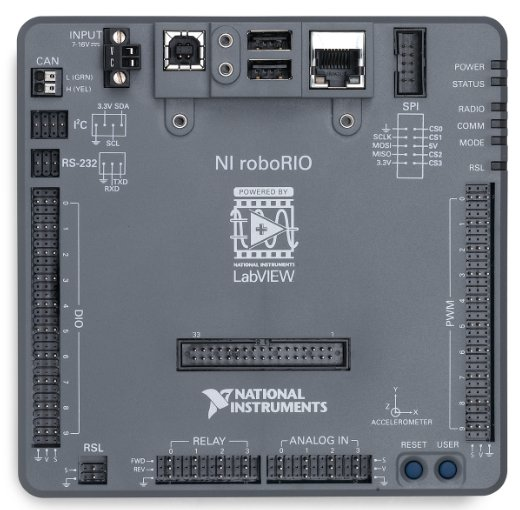

The [roboRIO](https://www.andymark.com/products/ni-roborio) is the main controller of every FRC robot. It uses CAN and PWM to provide instructions to motor controllers and components such as the Pneumatic Control Module. The roboRIO can also process inputs from sensors plugged into the DIO, Relay, or Analog ports.

In addition to this, the roboRIO also provides the power for the Robot Signal Light and is connected to the robot router over Ethernet.

### Connection Information

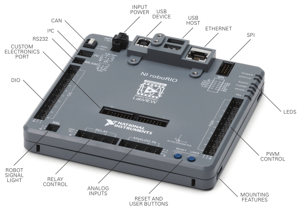

| Component                   | Connection                                                   | Port/Channel              | Appropriate Gauge/Type                                       |
| --------------------------- | ------------------------------------------------------------ | ------------------------- | ------------------------------------------------------------ |
| Power Distribution Panel    | roboRIO power input                                          | PDP 10A protected channel | [18 AWG silicone wire](<https://www.amazon.com/BNTECHGO-Silicone-Flexible-Strands-Stranded/dp/B01KCPL3GC/ref=pd_lpo_vtph_21_tr_img_2/143-1107074-5770767?_encoding=UTF8&psc=1&refRID=JXD50AXF8VPJF8KJP8NW>) |
| Robot Signal Light          | Power output to signal light                                 | RSL port                  | [22 AWG silicone wire](<https://www.amazon.com/BNTECHGO-Silicone-Flexible-Strands-Stranded/dp/B01K4RPE0Y/ref=pd_bxgy_60_img_2/143-1107074-5770767?_encoding=UTF8&pd_rd_i=B01K4RPE0Y&pd_rd_r=577ba9ab-87f5-11e9-b7e3-79e84739181c&pd_rd_w=92jXW&pd_rd_wg=FKFaP&pf_rd_p=a2006322-0bc0-4db9-a08e-d168c18ce6f0&pf_rd_r=KXKCQ5VDMGCA2ZXGJ2B2&psc=1&refRID=KXKCQ5VDMGCA2ZXGJ2B2>) |
| Router                      | PoE injector (male end)                                      | Ethernet port             | [CAT6 Cable](<https://www.amazon.com/dp/B01CRFVIWO/>)        |
| Pneumatic Control Module    | CAN output to PCM                                            | CAN port                  | [CAN Wire](https://www.vexrobotics.com/vexpro/motors-electronics/electricalwire.html) (22 AWG Yellow/Green) |
| Servo                       | PWM output to servo from roboRIO PWM rail                    | PWM Channels 0-9          | 22 AWG 3 pin wire (ribbon cable)                             |
| Banner Photoelectric Sensor | Banner Sensor data output to roboRIO Digital Input/Output (DIO) rail | DIO Channels 0-9          | 22 AWG 3 pin wire (ribbon cable)                             |
| RIOduino                    | RIOduino power and signal                                    | Custom Electronics Port   | N/A                                                          |

### Wiring Information

#### roboRIO Power

In order to connect the power wires to the roboRIO, use a small flathead screwdriver to loosen the screws on the side of the power input connector (properly known as the [Sauro Connector CTF020V8](https://www.andymark.com/products/sauro-connector-ctf020v8)). These screws are shown in the image below:

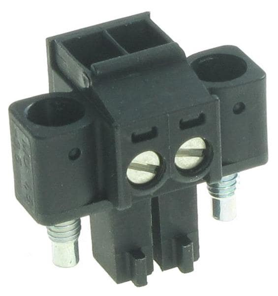

The connector above is not labeled as it is on the roboRIO, but it is very important to note that **the red wire MUST go into the port labeled "V"** and that **the black wire MUST go into the port labeled "C".** Strip about ~5/16" of jacketing off each wire, insert the wires into the connector, and then secure the wires by tightening each screw.

An example of a complete power run from the PDP to the roboRIO is shown below.

#### CAN Port

Strip ~5/16" of jacketing off of the yellow and green wires, then use your fingernail or a flathead screwdriver to push down the "buttons" of the Weidmuller terminals. A Weidmuller terminal and a pressed "button" are shown below.

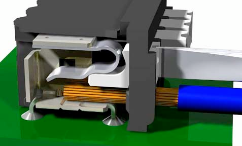

Insert the yellow wire into the terminal marked "YLW" and the green wire into the terminal marked "GRN". After inserting the wires, give them a gentle tug to verify that the connection is secure.

If you are using ferrules, insert each stripped wire into each ferrule and then crimp the ferrules using the appropriate crimping tool. The [white ferrules](<http://www.ctr-electronics.com/ferrule-18-awg.html>) are intended for **18 AWG wire**; thus, it is important to **strip twice as much wire and then fold the exposed wire in half in order to double its effective wire radius.** After the ferrules have been crimped and they have been tug tested, push the two wires into their respective terminals. No "button" pushing is required for this.

#### PWM and Other 3 Pin Ports

An appropriate cable for plugging into the roboRIO's PWM, DIO, Relay, and Analog ports is created as follows:

1. Cut a segment that is three wires wide from a ribbon cable. Be sure to measure the segment with respect to where your components are.
2. Strip ~1/8" of jacketing off of each wire in the segment.
3. Crimp a [22 AWG socket contact](<https://www.digikey.com/product-detail/en/molex-llc/0016020086/WM2510CT-ND/467802>) onto each wire. Before crimping, ensure that the exposed wire is set in the front set of teeth and that the insulated wire is set in the back set of teeth.
4. Insert each of the crimped wires into a [Male 3 Pin Locking Housing](https://www.digikey.com/product-detail/en/molex-llc/50-57-9403/WM2901-ND/115034). Each contact makes an audible click when inserted properly. If you are having trouble, try using a small flathead screwdriver to push contacts into the housing. It may also help to bend up the tabs on each socket contact. Test each insertion by tugging on each wire.
5. Plug the housing into the desired port on the roboRIO.

There are certain cases in which only one wire is required to be plugged into a roboRIO port (e.g. the two data wires from a Banner sensor are typically plugged into separate DIO ports). In these situations, it is recommended that additional uncrimped socket contacts are placed into the housing to prevent the housing from coming unplugged.

#### RSL Port

In order to create a cable which can plug into the RSL port on the roboRIO, a [Male 2 Pin Locking Housing](https://www.digikey.com/product-detail/en/molex-llc/50-57-9402/WM2900-ND/115029) must be used. The steps for crimping and inserting socket contacts into this type of housing are practically identical to the steps listed in the section above, except for the fact that 22 AWG silicone wire is used instead of ribbon cable. Additionally, the black power wire should be inserted into the side of the locking housing marked with an arrow.

### Status LEDs

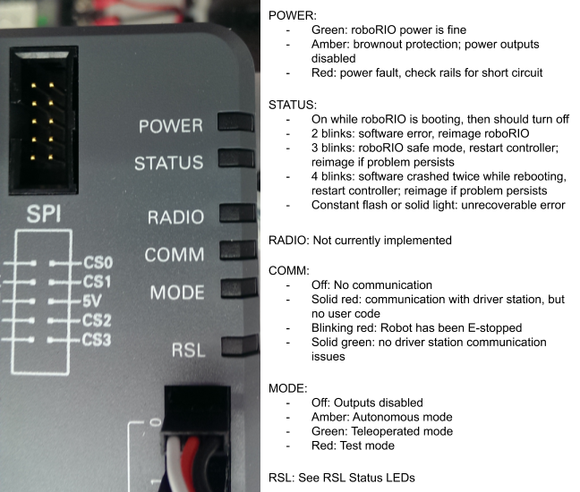

## Robot Router

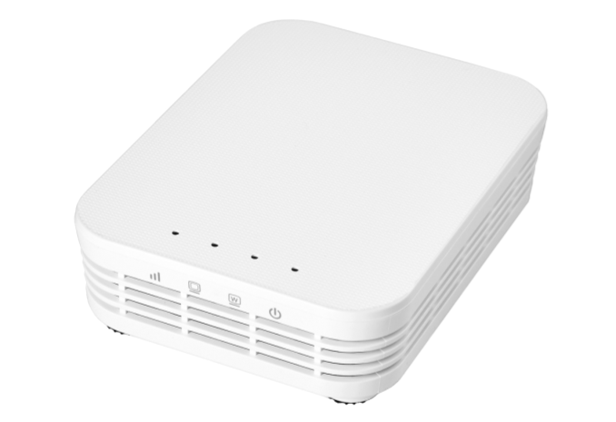

The [robot router](https://www.andymark.com/products/open-mesh-om5p-ac-dual-band-1-17-gbps-access-point-radio) uses WiFi to facilitate communication between the roboRIO and the driver station.

For information regarding the configuration of a robot router, visit the [WPI guide](http://wpilib.screenstepslive.com/s/4485/m/13503/l/144986?data-resolve-url=true&data-manual-id=13503).

### Connection Information

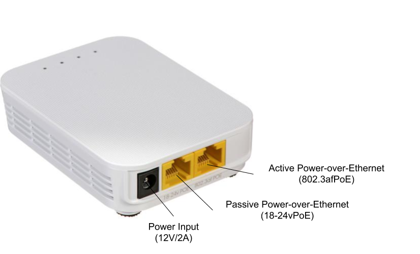

| Component                 | Connection                                                   | Port/Channel    | Appropriate Gauge/Type                                       |
| ------------------------- | ------------------------------------------------------------ | --------------- | ------------------------------------------------------------ |
| roboRIO                   | Ethernet cable from router to female end of POE injector or direct Ethernet connection | 18-24vPoE port  | [CAT6 Cable](<https://www.amazon.com/dp/B01CRFVIWO/>)        |
| Voltage Regulation Module | Power through the PoE injector or directly from the VRM into barrel jack | 12V/2A channel  | [18 AWG silicone wire](<https://www.amazon.com/BNTECHGO-Silicone-Flexible-Strands-Stranded/dp/B01KCPL3GC/ref=pd_lpo_vtph_21_tr_img_2/143-1107074-5770767?_encoding=UTF8&psc=1&refRID=JXD50AXF8VPJF8KJP8NW>) for direct connection or POE injector |
| Ethernet Switch           | Ethernet cable                                               | 802.3afPoE port | [CAT6 Cable](<https://www.amazon.com/dp/B01CRFVIWO/>)        |

### Wiring Information

#### PoE Injector

Team 401 uses this [passive PoE injector](https://www.amazon.com/iCreatin-Passive-Injector-Splitter-Connector/dp/B00XMHDETM?th=1) to provide power to the robot router. The following installation information is very important for preventing permanent damage to the router or roboRIO:

- **The male end of the PoE injector should be plugged into the roboRIO's Ethernet port.**
- Use an additional CAT6 cable to connect the router to the PoE injector; **this cable should run from the router's 18-24vPoE (passive) port to the PoE injector's female end.**
- Please ensure that the PoE injector's power wires are properly plugged into one of the 12V/2A terminal pairs.

### Status LEDs

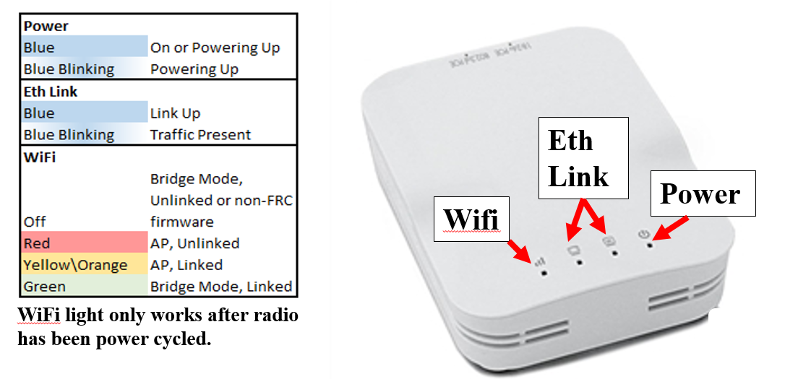

## Robot Signal Light

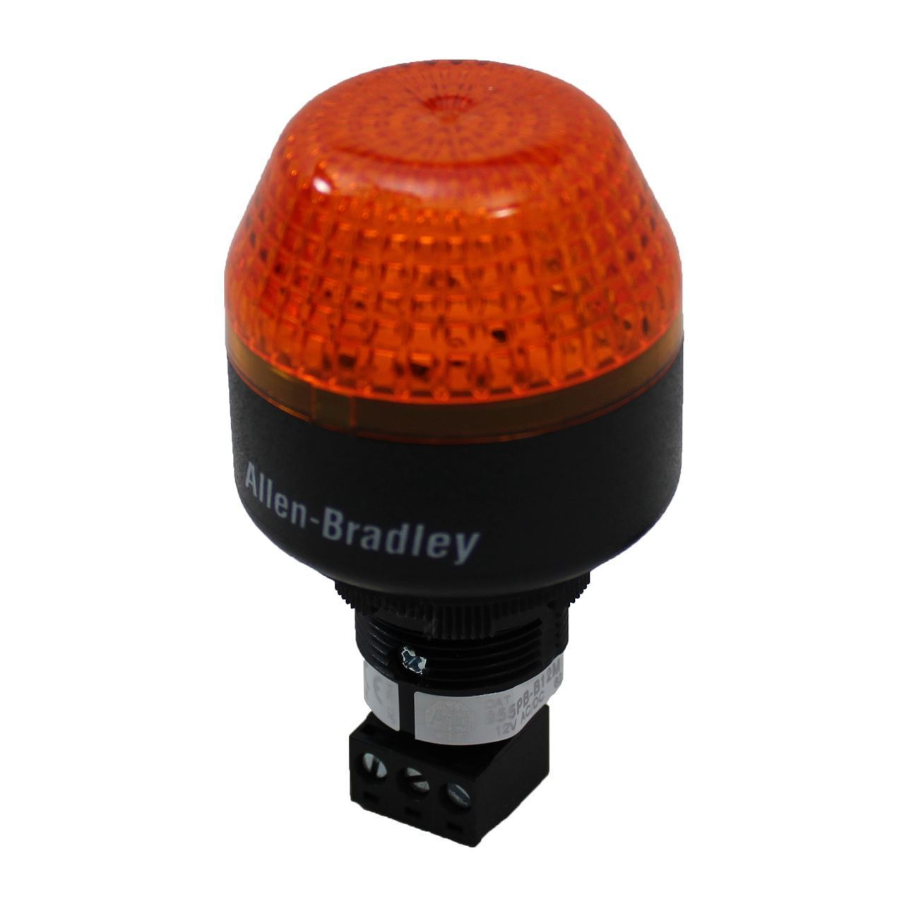

The Robot Signal Light is a mandatory safety feature of every FRC robot. As such, it is important that it is easy to see and that it is wired correctly. A solid RSL indicates that a robot is powered on and disabled, while a blinking RSL indicates that the robot is enabled.

### Connection Information

| Component | Connection                        | Port/Channel      | Appropriate Gauge/Type                                       |
| --------- | --------------------------------- | ----------------- | ------------------------------------------------------------ |
| roboRIO   | Power input from roboRIO RSL port | La/Lb/N terminals | [22 AWG silicone wire](<https://www.amazon.com/BNTECHGO-Silicone-Flexible-Strands-Stranded/dp/B01K4RPE0Y/ref=pd_bxgy_60_img_2/143-1107074-5770767?_encoding=UTF8&pd_rd_i=B01K4RPE0Y&pd_rd_r=577ba9ab-87f5-11e9-b7e3-79e84739181c&pd_rd_w=92jXW&pd_rd_wg=FKFaP&pf_rd_p=a2006322-0bc0-4db9-a08e-d168c18ce6f0&pf_rd_r=KXKCQ5VDMGCA2ZXGJ2B2&psc=1&refRID=KXKCQ5VDMGCA2ZXGJ2B2>) |

### Wiring Information

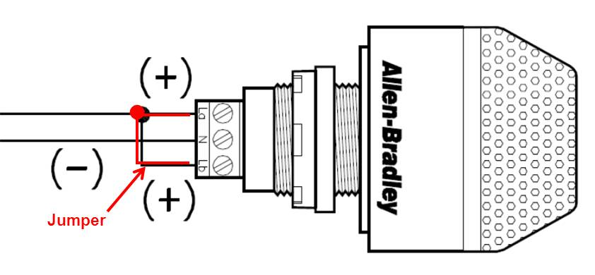

As can be seen in the above diagram, the RSL requires a jumper wire from the "La" terminal to the "Lb" terminal. The steps to wiring a RSL are as follows:

1. Measure and cut black and red 22 AWG wires of equal length. These measurements should be made with respect to where the roboRIO and RSL are located on the robot.
2. Strip ~5/16" of jacketing from the black wire. Insert the stripped end into the terminal marked "N" and use a small flathead screwdriver to tighten the terminal.
3. Strip ~5/16" of jacketing from the red wire. Insert the stripped end into the terminal marked "La." Tighten the terminal, but not entirely.
4. Cut a small piece of red 18 AWG wire. Strip both ends, then insert one end into the "La" terminal and tighten.
5. Insert the other end of the jumper into the terminal marked "Lb." Tighten the terminal.
6. Strip the other end of each long wire and crimp a socket contact onto each one, then insert both into a Male 2 Pin Locking Housing. The procedure for this can be found in the RSL section of the roboRIO wiring information.

A completely wired RSL is shown in the image below.

## Photoelectric Sensor

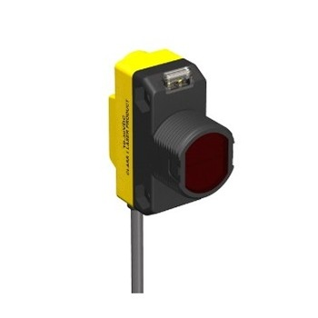

Photoelectric sensors are incredibly useful for detecting game pieces and are thus often used with the team's intake mechanisms. This team typically uses the Banner brand.

There are two types of Banner sensors used by the team: Diffuse and Retroreflective. The Diffuse sensor (QS18VP6LD) transmits infrared light which strikes an object; this light is then reflected off of the target and is registered by the built-in receiver, allowing the sensor to detect an object. This type of sensor is only effective over short distances due to the angles at which the light is reflected off of a target.

The Retroreflective sensor (QS18VP6LV), also known as the beam break, uses light reflected off of a piece of retroreflective tape to detect if an object has come between the sensor and the tape.

### Connection Information

| Component                 | Connection                                                   | Port/Channel | Appropriate Gauge/Type           |
| ------------------------- | ------------------------------------------------------------ | ------------ | -------------------------------- |
| Voltage Regulation Module | 12V/500mA power from VRM into brown and blue Banner wires, where brown is ground | N/A          | 22 AWG 2 pin wire (ribbon cable) |
| roboRIO                   | Black and white Banner wires into DIO ports (wiring depends on sensor purpose) | N/A          | 22 AWG 2 pin wire (ribbon cable) |

### Wiring Information

#### Sensor Power

Ideally, every Banner sensor found in the stock room already has its blue and brown power wires in a [Male 2 Pin Locking Housing](https://www.digikey.com/product-detail/en/molex-llc/50-57-9402/WM2900-ND/115029), with the blue wire on the arrow. The steps for making a power run from the VRM to a banner sensor are given below:

1. Cut a segment of ribbon cable that is two wires wide. Make sure that the segment is an appropriate length. If possible, choose appropriate wire colors (i.e. pick a ribbon cable segment containing a brown or blue wire).
2. Strip ~1/8" of jacketing from one end of both wires. Crimp a [22 AWG pin contact](https://www.digikey.com/product-detail/en/molex-llc/0016020107/WM2517CT-ND/467804) onto each wire and then place each crimped wire into a [Female 2 Pin Locking Housing](https://www.digikey.com/product-detail/en/molex-llc/0701070001/WM2533-ND/210968). If one of the Banner wires is the same color as a segment wire, it is preferred that the wires match when the cable is plugged in. Note which wire in the cable is ground.
3. Strip ~5/16" of jacketing from the other end of both wires. Then, plug the wires into one of the VRM's 12V/500mA terminal pairs.

#### Sensor Data

## Ethernet Switch

## Limelight 2

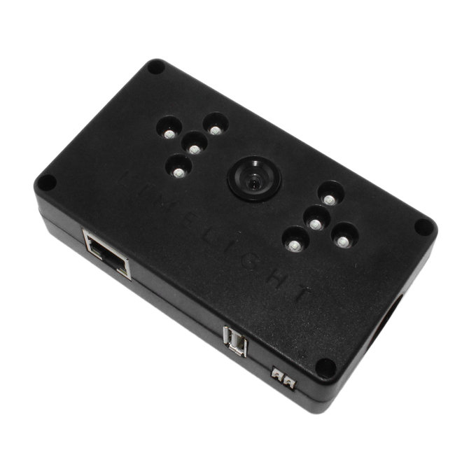

The [Limelight 2](https://limelightvision.io/products/limelight-2) is a smart camera which is used for locating reflective targets on field elements.

## RIOduino/LED Strip

