# Gears

1. TOC
{:toc}

This document provides an introduction to gears with a focus on FRC. For a discussion of other types of gears including shifters, bevels, and worm gears please see the [Other Gears](Other-Gears.md) document. For more detail on a topic please ask a team lead or the internet.

## What is a Gear?

A gear is “*a rotating machine part having cut teeth, or cogs, which mesh with another toothed part to transmit torque. Geared devices can change the speed, torque, and direction of a power source.”*

- *Spur* or *straight cut* gears are gears that have teeth projected radially. Spur gears are the most common gears in FRC. Spur gears produce no axial thrust.

- *Pinions* are input gears on motors (red). 

- *Bull gears* or just *gears*  are output gears driven by a pinion (blue).

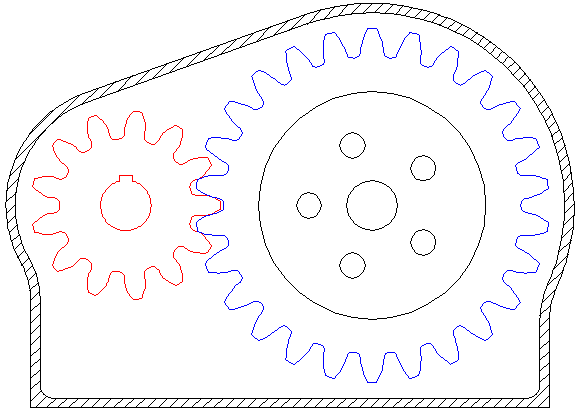

One other important takeaway from this animation is the directionality of rotation - *meshed gears spin in opposite directions*. Be sure to remember this when designing systems!

## Gear Ratios

Gears can increase or decrease speed and torque. Speed and torque are inversely dependent - *"as speed increases, torque decreases"*. 

- To calculate a gear ratio between an input gear and an output gear: $$ Ratio =  \frac{Teeth_{Input}}{Teeth_{Output}} $$

Given the input speed and torque and gearing ratio the output speed and torque can be found. 

- For rotational speed: $$ Speed_{Output} = Speed_{Input} * Ratio $$ 

- And for torque: $$ Torque_{Output} = \frac{Torque_{Input}}{Ratio} $$

### Gear Ratio Example

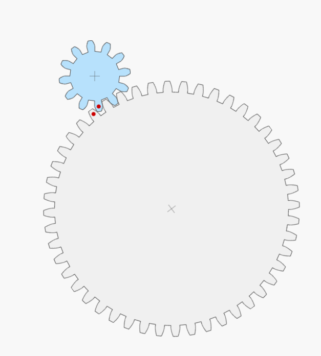

A 12 tooth gear spinning clockwise at a free speed of 100 revolutions per minute with a max torque of 10 foot-pounds meshes with a 48 tooth gear. What speed and torque will the 48 tooth gear have?

- Ratio: $$  Ratio =  \frac{Teeth_{Input}}{Teeth_{Output}} = \frac{12\ teeth}{48\ teeth} = \frac{1}{4} $$

- Speed:  $$  Speed_{Output} = Speed_{Input} * Ratio  = 100\ RPM * \frac{1}{4} = 25\ RPM$$

- Torque: $$ Torque_{Output} = \frac{Torque_{Input}}{Ratio} = \frac{10\ \text{ft-lb}}{\frac{1}{4}} = 4 * 10\ \text{ft-lb} = 40\ \text{ft-lb} $$

The gear pair a 1:4 gear ratio, so the 48 tooth gear will spin counterclockwise at one fourth the speed of the 12 tooth gear but will have four times the torque.

### Gearing Efficiency

While it is easy to treat gears as perfectly transferring speed and torque, there are losses in each stage of gearing. For FRC purposes we treat each spur gearing stage as 98 percent efficient. In the above example instead of getting $$25\ RPM$$ from the output get it would be expected to get $$25\ RPM * 0.98 = 24.5\ RPM$$ out. While this may seem trivial for a single stage of gearing reduction, when stacked over multiple gearing stages it can become significant as each additional stage has a multiplicative effect on efficiency: $$0.98 * 0.98 * 0.98* 0.98* 0.98* 0.98= 0.88$$. Over six stages of gearing 12% of transmitted power was lost!

## Idler Gears

*Idler* or *in-line* gears are gears in a gear train between a pinion and and output gear. Idler gears do not effect overall gear ratio, but do effect output spin directionality. Idlers are commonly used exactly for this directional inversion, they provide an easy way to spin parts of a system opposite directions with only one motor. Idlers can also be used to adjust spacing in systems where the location of the input and output are constrained and the gearing ratio cannot be altered.

### Idler Gears Example

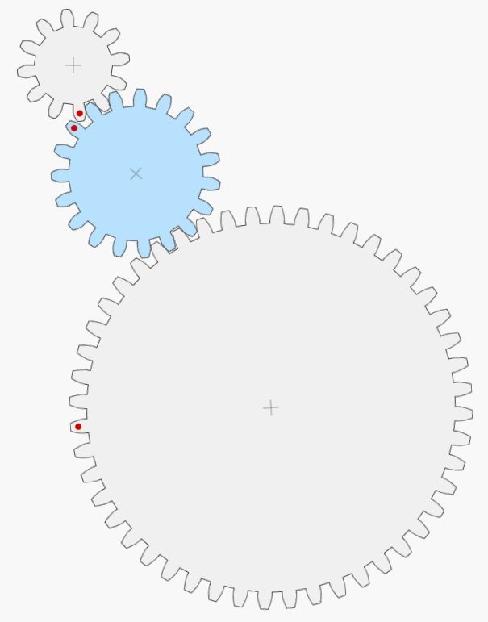

In this example a 12 tooth gear spinning clockwise at 100 RPM with 10 ft-lb of torque drives a 19 tooth idler gear and then drives a 100 tooth output gear. To verify that our gear ratio (and thus output speed and torque) is unchanged we can treat the system as two discrete gearing reductions and then multiply to find the overall ratio:

- Considering only the 12 and 19 tooth gears: $$ Ratio_{12\text{-}to\text{-}19} = \frac{Teeth_{Input}}{Teeth_{Output}} = \frac{12}{19}$$ 

- And then considering only the 19 and 48 tooth gears: $$ Ratio_{19\text{-}to\text{-}48} = \frac{Teeth_{Input}}{Teeth_{Output}} = \frac{19}{48}$$

- The overall gear ratio can be found by multiplying these two partial ratios: $$ Ratio_{Overall} = Ratio_{12\text{-}to\text{-}19} * Ratio_{19\text{-}to\text{-}48} = \frac{12}{19} * \frac{19}{49} = \frac{12}{48} $$

We can then find the output speed and torque of the gear train:

- Speed:  $$  Speed_{Output} = Speed_{Input} * Ratio  = 100\ RPM * \frac{1}{4} = 25\ RPM$$

- Torque: $$ Torque_{Output} = \frac{Torque_{Input}}{Ratio} = \frac{10\ \text{ft-lb}}{\frac{1}{4}} = 4 * 10\ \text{ft-lb} = 40\ \text{ft-lb} $$

**This is the same as the gear ratio without the idler!** But be sure to think through directionality of spin - the 12 tooth gear was spinning clockwise, so the 19 tooth gear will spin counterclockwise, and the 48 tooth gear will then spin **clockwise**, unlike in the example without an idler. 

## Compound Gearing

Compound gearing puts two gears on the same axle (coaxial) to produce larger changes in speed and torque as the gear ratios for each gearing stage is multiplied. Gears that share an axle in a compound gearing setup will have the same speed and torque. 

- The equation for overall gearing ratio in a compound gearing setup is: $$ Ratio_{Overall} = Ratio_{First\ Stage} * Ratio_{Second\ Stage} $$

While this formula *is* identical to the idler gear case, in a compound gearing setup no gears are shared between gearing stages so the intermediate gears in the train will change the overall ratio and cannot be ignored.

### Compound Gearing Example

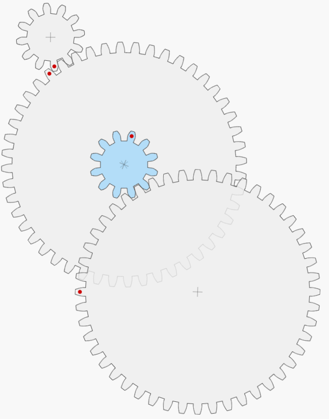

Consider a 12 tooth pinion spinning clockwise at 100 RPM with 10 ft-lb of torque driving a 48 tooth gear that is coaxial with a second 12 tooth gear, and let the second 12 tooth gear drive a second 48 tooth gear. What will be the overall gearing ratio, output speed, and output torque?

- For the first stage of gearing reduction: $$ Ratio_{First\ Stage} = \frac{Teeth_{Input}}{Teeth_{Output}} = \frac{12}{48} = \frac{1}{4} $$

- And for the second stage of gearing reduction: $$ Ratio_{Second\ Stage} = \frac{Teeth_{Input}}{Teeth_{Output}} = \frac{12}{48} = \frac{1}{4} $$

- The overall gearing ratio then is: $$ Ratio_{Overall} = Ratio_{First\ Stage} * Ratio_{Second\ Stage} = \frac{1}{4} * \frac{1}{4} = \frac{1}{16} $$

Finding the output speed and torque:

- Speed:  $$  Speed_{Output} = Speed_{Input} * Ratio  = 100\ RPM * \frac{1}{16} = 6.25\ RPM$$

- Torque: $$ Torque_{Output} = \frac{Torque_{Input}}{Ratio} = \frac{10\ \text{ft-lb}}{\frac{1}{16}} = 16 * 10\ \text{ft-lb} = 160\ \text{ft-lb} $$

Unlike the idler gearing example, compound gearing did produce a change in outputs. Directionality of output spin is worth considering in the compound gearing case: the first 12 tooth gear was spinning clockwise, the first 48 tooth gear will spin counterclockwise, the second 12 tooth gear is locked on the same axle as the 48 tooth gear so will also spin counterclockwise, and finally the output 48 tooth gear will spin clockwise. Directionality of the output in both idler and compound gearing setups depends on the number of gearing stages used, be sure to evaluate specific systems.  

## Gear Sizing

### Terminology

- *Root diameter*: The diameter of the gear at the bottom of the tooth profile.
- *Outer diameter*: Commonly abbreviated as $$OD$$, the diameter of tip of the gear teeth. Be careful not to confuse with pitch diameter when designing systems- gears spaced based on outer diameters will not mesh!
- *Pitch diameter*: Commonly abbreviated as $$PD$$, also called the effective diameter, the diameter at which a gear perfectly meshes with another gear.

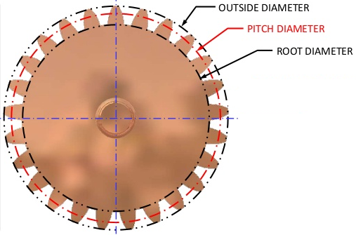

- *Addendum*: The radial distance from the pitch diameter to the outer diameter of the gear. Gear manufacturers can modify this to "cheat" the sizing of their gears.

- *Dedendum*: The radial distance from the pitch diameter to the root diameter of the gear. Dedendum can be modified by gear manufacturers to help "cheat" gear sizing and is commonly modified to add 'clearance' to a gear mesh.

- *Face width*: the width of a gear's teeth. Wider gear teeth will typically be stronger.

  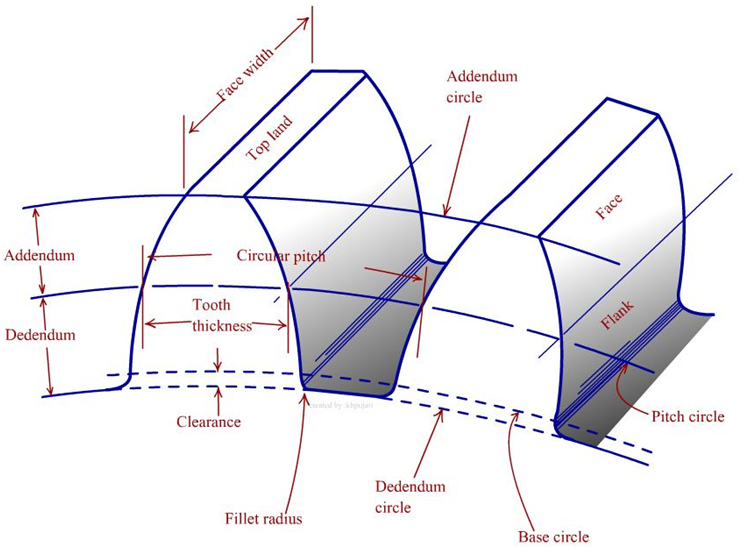

- *Diametrical pitch*: Commonly abbreviated as $$DP$$. The number of of gear teeth per inch of pitch diameter. Most FRC gears are 20 DP- they have 20 teeth per inch of pitch diameter. Some FRC gears are 32 DP- they have 32 teeth per inch of pitch diameter.

- *Center distance*: Also called *center-to-center distance* and commonly abbreviated $$CtoC$$, the distance at which two gear pitch diameters are tangent, this is the "correct" distance to place gears two gears apart for them to mesh. For FRC purposes a 0.003" *center add* is typically added to a calculated center distance to account for manufacturing tolerances and ensure a less tight gear mesh.

- *Backlash*: the maximum distance or angle through which any part of a gear can move in one direction without applying appreciable force or motion to the next gear in the system. Backlash can be affected by slop in gear-to-shaft fit, added clearance in gear design, and any center add.

### Equations

- Gear pitch diameter ($$PD$$) given tooth count ($$K_t$$) and diametrical pitch ($$DP$$): $$ PD = \frac{K_t}{DP}$$
- Gear outer diameter ($$OD$$) given tooth count and diametrical pitch: $$OD = \frac{K_t + 2}{DP}$$
- Center distance ($$CtoC$$) given pitch diameter of two gears: $$ CtoC = \frac{PD_1 + PD_2}{2}$$

### Gear Sizing Examples

A 20 DP gear with 3.5" OD: 

$$ K_t = OD * DP - 2 \\ K_t = 3.5 * 20 - 2 \\ K_t = 68$$

Or for a 32 DP gear with 0.4375" OD:

$$ K_t = OD * DP - 2 \\ K_t = 0.4375 * 32 - 2 \\ K_t = 12$$

### Gear Spacing Examples

A 20 DP 12 tooth gear meshes with an 84 tooth gear:

$$ CtoC = \frac{K_{t1} + K_{t2}}{2*DP} + 0.003\text{"} \\ CtoC = \frac{12 + 84}{2 * 20} + 0.003 \text{"}\\ CtoC = 96 / 40 + 0.003\text{"} \\ CtoC = 2.403\text{"}$$

A 32 DP 20 tooth gear meshes with a 65 tooth gear:

$$ CtoC = \frac{K_{t1} + K_{t2}}{2*DP} + 0.003\text{"} \\ CtoC = \frac{20 + 65}{2 * 32} + 0.003 \text{"}\\ CtoC = 85 / 64 + 0.003\text{"} \\ CtoC = 1.331\text{"}$$

## Pressure Angles

When two gears mesh correctly their *pitch circles* (circles based on the pitch diameter) should be tangent. The tangent line between these two pitch circles is called the *pressure line*, and the angle between the pressure line and a horizontal axis is called the *pressure angle*. Most gears in FRC are 14.5$$^{\circ}$$ pressure angle, 32 DP gears commonly used with 775s are 20$$^{\circ}$$ pressure angle. Different pressure angles correspond to different profile gear teeth, always make sure both diametrical pitch and pressure angle match for any geared system.

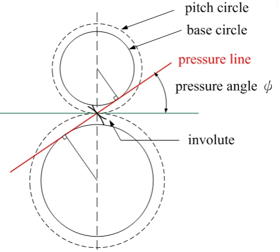

## Gear Forces

In a gear mesh where torque is being transferred there are forces exerted onto the gears and the axles they ride on. Contact force along the pressure line of the gear mesh is called the *normal force* ($$W_n$$). Force tangent to the center line of the gear mesh is called the *tangential force* ($$W_t$$) and is used when calculating transmitted power and force exerted on gear teeth. Force exerted along the center line of the gear mesh is called the *radial* or *separation force* ($$W_r$$) and is the component of the force applied to the shaft that each gear rides on.

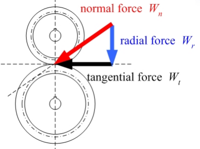

The relationships between these gear forces are:

 $$W_t = W_n * cos(\phi), \\W_r = W_n * sin(\phi),\\ W_r = W_t * tan(\phi)$$

## Gear Strength

The maximum of gear teeth can be modeled by treating each gear tooth as a cantilevered beam with force applied tangentially at the tip. 

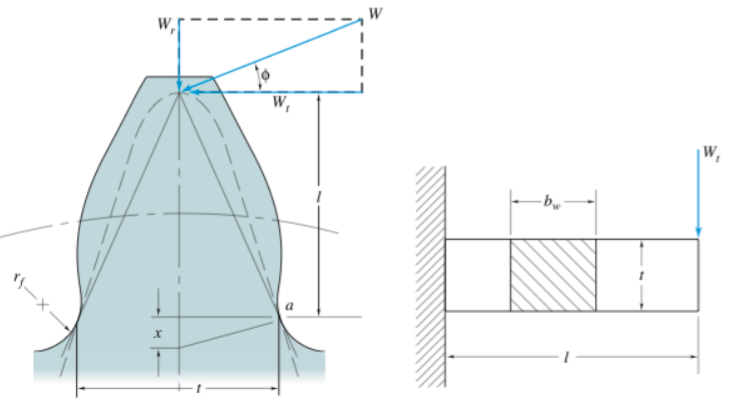

Bending stress on a gear tooth ($$\sigma$$) can be defined as: $$\sigma = \frac{W_t*P}{F*Y}$$

Where $$W_t$$ is the tangential load applied on the gear tooth, $$P$$ is the diametrical pitch of the gear, $$F$$ is the face width of the gear tooth, and $$Y$$ is a constant called a *Lewis Factor* determined by the pressure angle and number of teeth on the gear.

The bending stress equation can then be modified to account for impacts at higher velocities that cause higher stresses using the *Barth Velocity Factor*: $$K_v = \frac{1200 + V}{1200}$$ where $$V$$ is the surface speed at the pitch diameter of the gear in feet per minute. The expanded bending equation becomes: $$\sigma = \frac{W_t*P}{F*Y} * K_v $$

Using the ultimate tensile strength of the gear material ($$S_{ut}$$) a reasonable maximum allowable bending stress ($$S$$) can be defined as $$S=\frac{S_{ut}}{3}$$. 

Using the equation for bending stress and setting the bending stress to the maximum allowed bending stress, maximum safe tooth load ($$W_t$$) can be found:

 $$ \sigma = \frac{W_t*P}{F*Y} * K_v \\ \sigma = S\\ S = \frac{W_t*P}{F*Y} * K_v\\ W_t = \frac{S*F*Y}{K_v * P} \\ W_t = \frac{S_{ut} * F * Y * 1200}{3 * P * (1200 + V)}$$ 

## Design Calculator: [calc.team401.org](http://calc.team401.org)

All of the calculations discussed can be done manually, and knowing how to find center-to-center distance or gear pitch diameter is **very** useful, but some equations such as gear loading can be tedious and require look up tables. To save time students can use the Team 401 design calculator available at [calc.team401.org](http://calc.team401.org) to save time.

### Calculator Examples

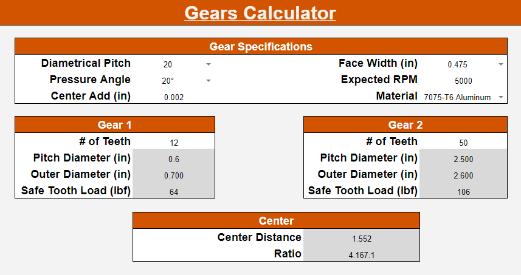 

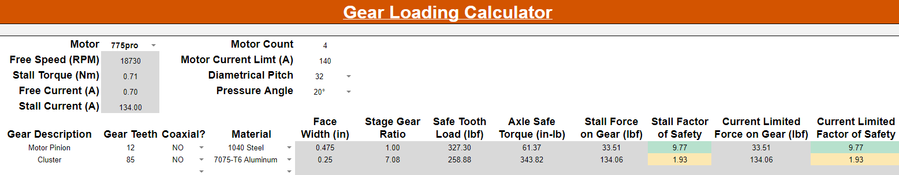

## More Information

For more information on gears, please review the [Other Gears](Other-Gears.md) document or consult with a team lead.