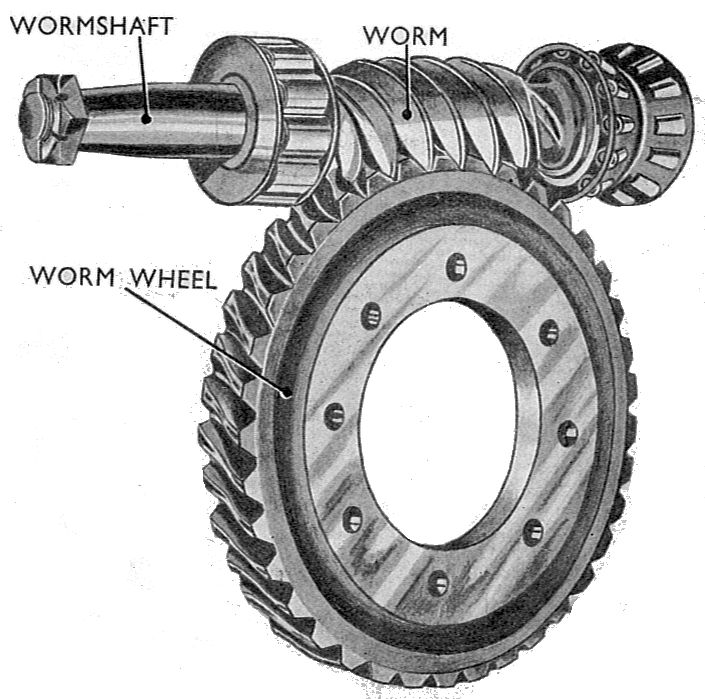
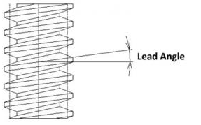
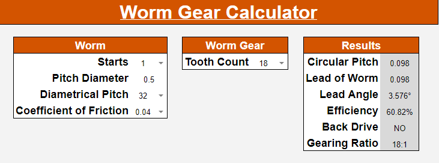
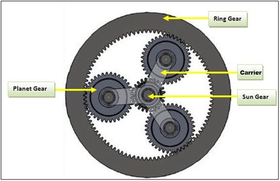

# Other Gears

1. TOC
{:toc}

Beyond typical spur gears discussed in the Gears page, there are several special types of gears that may be encountered in FRC.

## Shifter Gears

Shifter gear setups are common in FRC and allow the gearing ratio for a drivetrain or mechanism to be changed on-demand. Shifting setups in FRC are actuated either by a servo motor with a linkage, or by a pneumatic piston. Servo shifting setups do not produce much torque and cannot shift on-the-fly but instead must fully stop before changing gears. In the event of servo failure the system *should* stay in the last engaged gear due to linkage design. Piston shifting setups can produce enough force to shift on-the-fly and have become the default option in FRC. Some piston shifters also include a spring return built into the piston so even if air pressure is lost the system will default to a chosen gear.

### Ball Shifter Gears

Ball shifters actuate a *shifter rod* to different positions inside of a hollow shifter shaft to force different sets of ball bearings out to transfer torque between the *ball shifter shaft* and a *ball shifter gear*. Ball shifter setups can be extended to multiple gear sets, in FRC ball shifters commonly only two gear sets.

*Ball shifter shaft*: a hollow shaft containing the shifter rod and pockets for ball bearings to seat in. The VexPro ball shifter shaft commonly used in FRC features a female ThunderHex socket with thru pin hole on the output side, by pushing the pin out, heating the shaft to break the factory installed Loctite compound, and pulling the stock output shaft can be removed to be replaced with a longer or otherwise custom output.

*Shifter rod*: a rod contained inside of the ball shifter shaft with a profiled head to force ball bearings out of the shifter shaft and to engage with ball shifter gears.

*Ball shifter gears*: gears with pockets cut into their inner bore to seat ball bearings and transfer torque from a ball shifter shaft. Typically use bronze bushings as a bearing surface for contact with the ball shifter shaft.

### Dog Shifter Gears

Dog shifting setups, similar to ball shifters, actuate between gears to change a system's gearing ratio. Unlike ball shifters, dog shifters cannot be extended to more than two gears. Dog shifters are composed of two primary parts: *dogs* and *dog gears*. Dog shifters tend to be slower than ball shifters to engage in a new gear when shifting.

*Dog*:  a part that prevents movement or imparts movement by offering physical obstruction. In FRC dogs are typically double sided and are used to engage gears in shifting setup.

*Dog gears*: Spur gears with matching features on one side to mate with a dog. Dog gears ride on bearings and transmit no torque until engaged by the dog.

Dog gears can be used to improve gearbox packaging by providing clearance for a large initial gearing reduction in the space between the gears as seen in this example from one of Team 254's gearboxes:

Some teams have reported issues with dog shifting setups in past years; if not designed correctly the force exerted on dogs can break them. Most FRC vendors have mitigated these failures within the first season of launching new shifter gearboxes, but Team 401 still exclusively uses ball shifter gearboxes.  

## Bevel Gears

*Bevel gears* are gears where the axes of the two shafts intersect and the tooth-bearing faces of the gears themselves are conically shaped. Bevel gears are most often mounted on shafts that are 90 degrees apart, but can be designed to work at other angles as well. The pitch surface of bevel gears is a cone. A bevel gears in a set with a gearing ratio of 1.0 (same tooth count on both gears) are called *miter gears*.

Similar to standard spur gears, the gearing ratio for a bevel gear pair is determined by the ratio in tooth count between the input gear and the output gear. Bevel gears are also modeled as 98% efficient Unlike spur gears though, bevel gears cannot be mixed and matched; a 16 tooth bevel gear designed to mesh with a 60 tooth bevel gear will **not** mesh with another 16 tooth bevel gear.

Common applications for bevel gears in FRC are on roller intakes to allow one motor to power multiple roller shafts, and to transfer power to swerve module wheels. Below is an example of Team 111: Wild Stang's 2016 intake using two pairs of miter gears on a *beaver tail* roller intake.

Unlike spur gears, bevel gears produce force along their axis of rotation in addition to the standard tangential and radial forces.

Bevel gears, similar to spur gears, are modeled as 98% efficient for FRC purposes. 

## Worm Gears

A worm drive is a gearing setup in which a screw form gear called a *worm* meshes with with a spur gear like *worm gear*. 

Similar to bevel gears worm gears transfer power 90$$^{\circ}$$ from their input. The gear ratio for worm gears is related to bevel and spur gears, but is the ratio of worm *starts* (individual spirals on the worm) to teeth on the worm wheel instead of a ratio of gear teeth. This difference in gearing ratio means worms with a single start can achieve significantly higher gear reductions than spur gears in a comparable volume. In large reduction cases worm gear setups can suffer significant efficiency penalties with up to 50% losses per stage in extreme cases. To mitigate losses worms and worm gears are commonly made out of dissimilar materials (steel worms and bronze worm wheels) to reduce the coefficient of friction between the two. In FRC worms are commonly used in systems where back-driving (*the ability of load applied on an output gear to drive the input*) is not desired as worm wheels commonly will not be able to cause the worm to spin. Caution must be exercised when using non-back-drivable worm gear setups, the system may shear teeth off of the worm wheel if shock loaded.

### Worm Gear Terminology and Equations

- Gear ratio ($$R$$): the ratio between revolutions in the input worm and the output wheel. Found by comparing worm starts ($$Worm_{Starts}$$) to wheel teeth ($$Wheel_{Teeth}$$): $$R = \frac{Worm_{Starts}}{Wheel_{Teeth}}$$
- Circular Pitch ($$CP$$): *the distance along the pitch circle or
  pitch line between corresponding profiles of adjacent teeth*. While often not directly useful for FRC applications, circular pitch does come into play for calculating other worm gear values of interest. Circular pitch can be defined in terms of diametrical pitch as pi divided by diametrical pitch: $$CP = \frac{\pi}{DP}$$
- Worm Pitch Diameter ($$PD_W$$): the diameter of the worm for correct gear meshing with a worm wheel. Given a measured outer diameter of the worm ($$D_o$$) and a know diametrical pitch ($$DP$$): $$PD_W = D_o - \frac{2}{DP}$$

- Lead ($$L$$): *the axial advance of a worm wheel for one complete rotation of a worm*. Lead is found by multiplying the number of starts on a worm and the circular pitch of the worm wheel: $$L = CP * Worm_{Starts}$$

- Lead angle ($$\gamma$$): *the angle of spiral threads on a worm*. Lead angle is used to evaluate both efficiency and back-drivability of worm gears, and can be found from the worm pitch diameter and lead: $$\gamma = tan^{-1}(\frac{L}{\pi * PD_W})$$

  

- Efficiency ($$E$$): *a measure of the loss in transmitted power between the input and output of a gearing system*. As discussed earlier, efficiency of a worm gear system can be extremely variable. Material selection, lubrication, and correct spacing all affect efficiency, but lead angle also plays a critical role. To maximize efficiency worm gear ratios should be kept as low as feasible. For a standard bronze worm wheel and steel worm coefficient of friction ($$f$$) values should range from 0.03 to 0.05. Given this coefficient of friction, efficiency is estimated as: $$E = \frac{tan(\gamma)*(1 - f*tan(\gamma))}{f + tan(\gamma)}$$

- Back-drivability: *the ability of load applied on an output gear to drive the input*. Worm gear systems are generally back-drivable if the lead angle is greater than eleven degrees: $$\gamma > 11^{\circ}\implies Backdrivable$$   

### Calculator Support

The [Team 401 Design Calculator](http://calc.team401.org) has full support for worm gears and can be used instead of manual calculation.

## Planetary Gears

Planetary (or epicyclic) gear trains are special spur gear setups where outer *planet* gears revolve around a central *sun* gear while being supported by a *carrier* and contacting an outer *ring* gear.

## Cycloidal Gears

asdf

