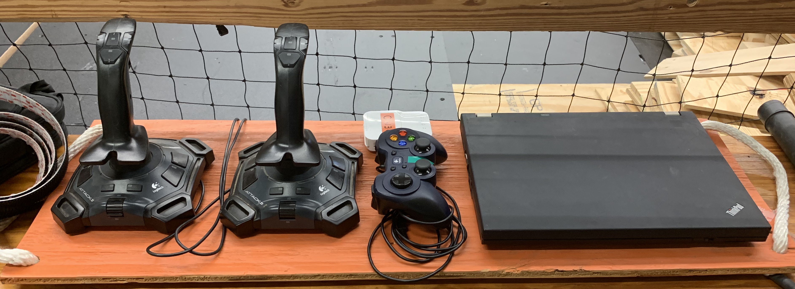
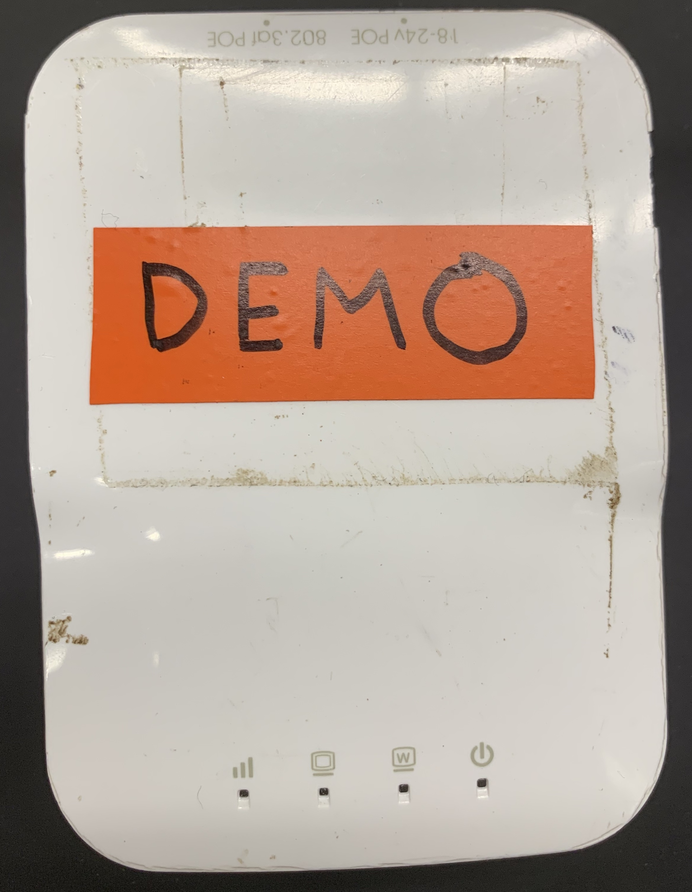

# Demo Procedures

This article documents the items and actions necessary for successful demos of the 2019 robot.

 1. TOC
{:toc}

## Essential Items Checklist

In order to ensure that there are as few technical issues as possible, please make sure that all of the following items are brought to a demo:

### Demo Driver Station

**This is the only driver station that should be used for robot demos.** It should have all the items pictured in this image: two joysticks, a Logitech Gamepad controller, the demo radio, and the ThinkPad laptop. The Gamepad and demo radio are secured to the driver station.

An additional image of the Demo radio is provided below for clarity:

If possible, mount the demo radio on the robot before packing the robot. If not, swap any radio on the robot for this radio while setting up tables, etc. for the demo. It is already configured to work with the demo driver station.

### Battery Chargers

Please ensure that the battery chargers are fully loaded with 6 lead acid batteries. Check each battery for loose or exposed leads, damaged casings, or any other potential issues.

(insert picture here, maybe)

### Game Pieces

Pack one hatch panel and at least one piece of cargo.

### Power Strip

