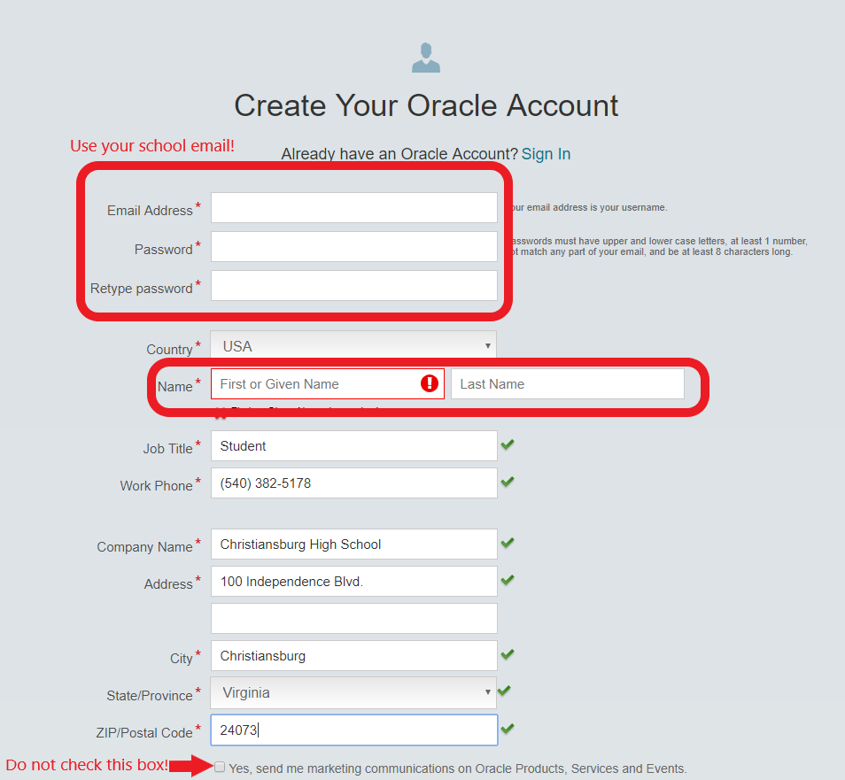
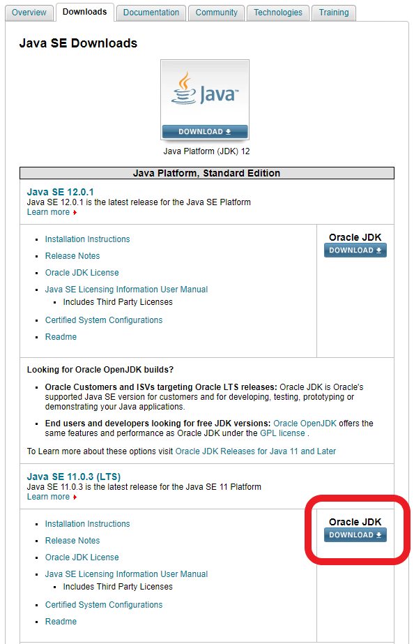
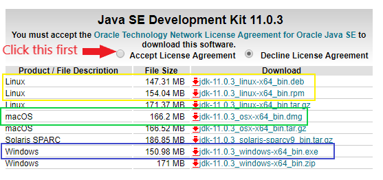
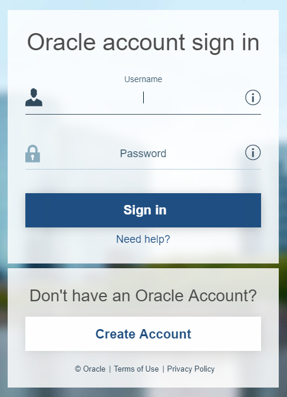

# Installing the Oracle Java SE JDK

In this guide, we will be installing version 11 of the Orcale JDK.  This version should be compatible with all FRC projects 2019 and forward.  While these instructions should be appliciable for any version of the JDK, version 11 is the release we will be using on the team.

## Creating your Oracle Account

Before we can download the Oracle JDK, we need to create an Oracle account.  Follow [this link](https://profile.oracle.com/myprofile/account/create-account.jspx) to get to the account creator page.

Fill out the fields as shown above, inserting your own information in the areas boxed in.  Use the phone number and address info for Christiansburg High School, as shown.  We recommend using your school email so it's easy to remember, but you can use whatever email you want.  Make sure not to check the last checkbox unless you want spam email!  Remember your password as we'll use it shortly to download the JDK.  **You may be asked to verify your email address.  If so, click the link sent to your email before continuing!**

## Downloading the JDK

Follow [this link](https://www.oracle.com/technetwork/java/javase/downloads/index.html) to get to the main Java SE download page.  **Note that this page is different from java.com!  Java.com does not download the right version of Java SE.**

Click the download button under the Java SE 11.0.3 (LTS) section.  LTS stands for Long Term Support, meaning this version will be around for a while.  Note that although Java 12 is available above, we are using Java 11.

Click the circle next to "Accept License Agreement" first.  Next, choose the appropriate installer for your system.  For Linux, choose the appropriate file for your system's package manager from the options boxed in yellow.  For Mac, choose the dmg file boxed in green.  For Windows, choose the exe file boxed in blue.  **Do not choose the zip or tar.gz files!**

You will now be presented with a sign in page.  Since we already created an Oracle account, we can now sign in.  In the Username field, enter the email address you used when signing up.  Enter your password, and then click "Sign in".  The file you selected should then proceed to download.

From here, the installation procedure differs depending on what operating system you are running.  Accept all the default values when running the installer.

You should now have the Oracle Java SE JDK 11 installed on your system.  **If you have any trouble, ask the Lead Programmer for help.**