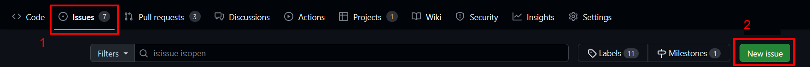

# Software Development Workflow
{: .no_toc }

This document outlines the process to follow when working on software projects on the team.

1. TOC
{:toc}

## GitHub Issues

Github Issues are the way we track the software work we are doing. If you are assigned to an already written issue, you can skip ahead to the [Start Work](#start-work) section.

### Create an Issue

If you find a bug or come up with an idea for something to improve in the code, create an issue. To do this, go to the repository on GitHub, click the Issues tab, and then click "New Issue"



From there, name your issue something descriptive. To fill out the description section, consider using the following template:
```
**Summary**
// Put a high level summary of the feature to add or problem to solve

**Work Scope**
// Make a list of work items/steps to do to work the task. If you don't know the steps, you could leave this blank and update it later.
- Work item 1
- Work item 2

**Verification**
// Make a list of things that need to be done to confirm that everything works before this issue is closed
- Verification check 1
- Verification check 2
```

On the right side panel, make sure to assign someone, add a label, and add the issue to a project/milestone. You can do this by clicking the gear icons.

## Start Work

To start work on an issue, use your favorite Git client on your computer to checkout and pull the `main` branch (to get the latest updates). In Git bash this looks like:
```
git checkout main
git pull
```

Then create a new branch off of `main` with:
```
git checkout -b new-branch-name
```

> **Note:** Work on only one github issue per branch. This helps avoid merge conflicts and other confusion when working on projects with other people.

## Write Code
With the branch created, now you can write code. Typically this is done in VS Code when working on the robot codebase. The implementation details are issue specific, but there are best practices to follow outlined in the subsections below.

> **Note:** Make sure you are on the correct branch before writing code.

### Commit and Push
When reaching a development milestone, make sure to commit your code and push it to remote. Some examples of a development milestone are:
- Finishing a step of the work plan
- Completing code prior to making a pull request
- Responding to code reviews

You also **must commit and push your code before leaving at the end of the day.** This allows others to have visibility on what you are working on, and makes it possible for people to keep making progress if you can't make a meeting.

To commit your code, make sure to add the files you want to the commit (stage the changes). To add all the files in the current directory with Git Bash:
```
git add .
```

Then make a commit. Commits should have useful messages and it is helpful if they contain a reference to the issue number your branch is related to.
```
git commit -m "#issue-number: a helpful and concise message that details the work done in this commit"
```

Finally, push the code to GitHub:
```
git push
```
If an error appears, follow instructions in the terminal or ask a lead programmer / mentor.


### Keep Branch Updated

When developing code, the working branch should be kept up to date with the most recent changes. Maintaining your branch is helpful because it:
- Reduces merge conflicts with the `main` branch.
- Increases confidence that your code will work when merged to `main`.

There are many ways to keep the branch updated. We will use rebase because it maintains linear history.

TODO: Put a diagram explaining how rebase works

First, make sure `main` is updated:
```
git checkout main
git pull
```

Now you can rebase the current branch on top of `main` like so:
```
git checkout branch-you-want-to-rebase
git rebase main
```

Rebase works by going through each commit and stacking it on top of the parent branch (in this case `main`). If there are merge conflicts for any commit, rebase will pause for you to resolve the conflict. You can resolve the conflict in VS Code and then do the following to continue the rebase:
```
git add .
git rebase --continue
```

After a successful rebase, whenever you want to push the code to GitHub you will need to do so with force. It is best practice to do the following:
```
git push --force-with-lease
```
However, if you know that nobody else is working on your branch you can do
```
git push -f
```

## Make a Pull Request

Once you believe your code is ready to merge into the `main` branch, make a pull request (PR) on GitHub

### Draft Pull Requests


### Code Review

### 

 