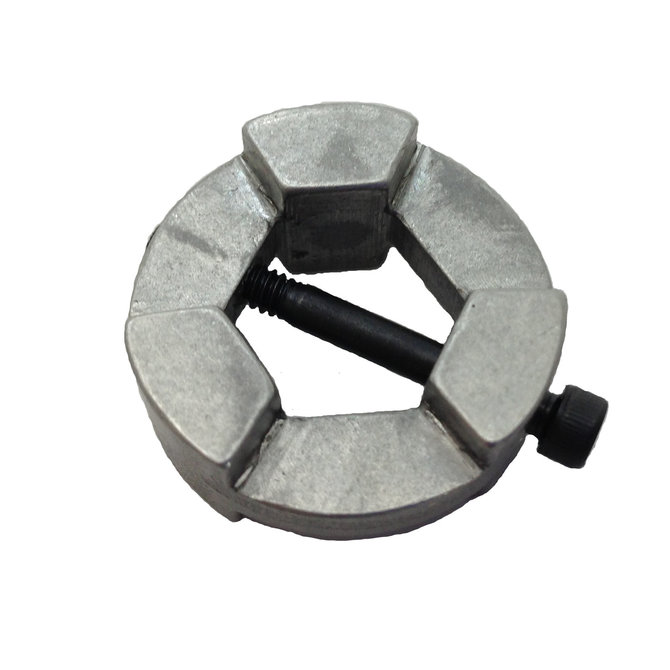
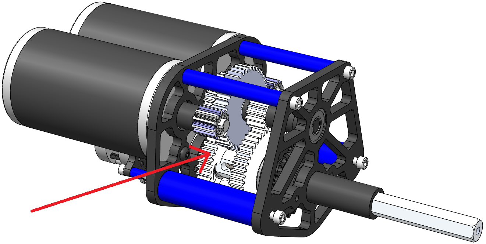
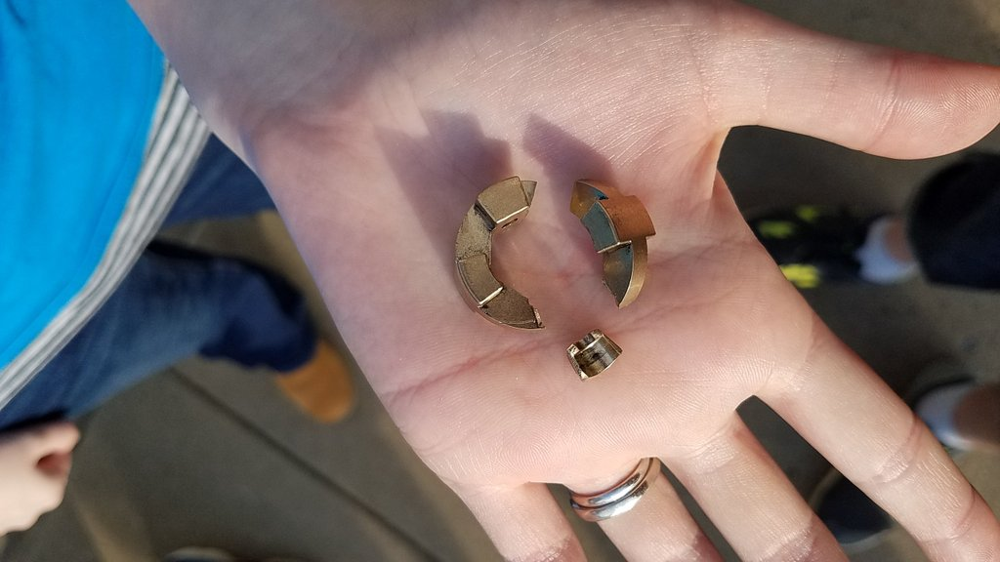

# Other Gears

1. TOC

{:toc}

Beyond typical spur gears discussed in the Gears page, there are several special types of gears that may be encountered in FRC.

## Shifter Gears

Shifter gear setups are common in FRC and allow the gearing ratio for a drivetrain or mechanism to be changed on-demand. Shifting setups in FRC are actuated either by a servo motor with a linkage, or by a pneumatic piston. Servo shifting setups do not produce much torque and cannot shift on-the-fly but instead must fully stop before changing gears. In the event of servo failure the system *should* stay in the last engaged gear due to linkage design. Piston shifting setups can produce enough force to shift on-the-fly and have become the default option in FRC. Some piston shifters also include a spring return built into the piston so even if air pressure is lost the system will default to a chosen gear.

### Ball Shifter Gears

asdf

### Dog Shifter Gears

In FRC dog shifting setups are commonly actuated 

*Dog*:  a part that prevents movement or imparts movement by offering physical obstruction. In FRC dogs are typically double sided and are used to engage gears in shifting setup.

*Dog gears*: Spur gears with matching features on one side to mate with a dog. Dog gears ride on bearings and transmit no torque until engaged by the dog.

Dog gears can be used to improve gearbox packaging by providing clearance for a large initial gearing reduction in the space between the gears. Example: Team 254 2017 gearbox:

Some teams have reported issues with dog shifting setups in past years; if not designed correctly the force exerted on dogs can break them.

## Bevel Gears

asdf

## Worm Gears

asdf

## Planetary Gears

asdf

## Cycloidal Gears

asdf

