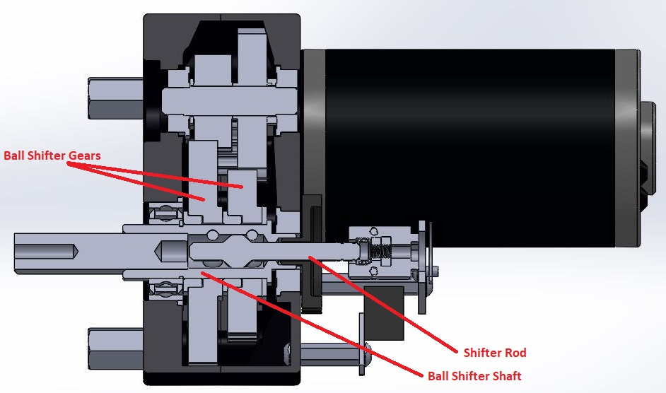
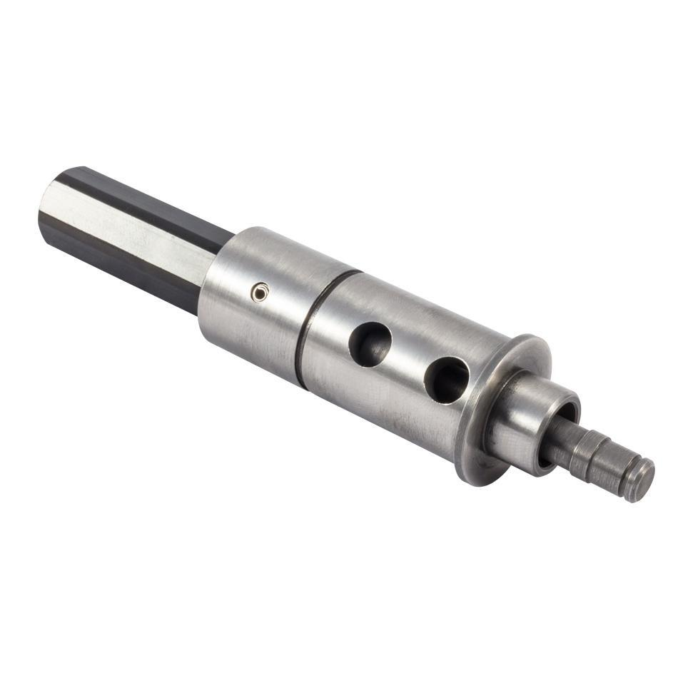
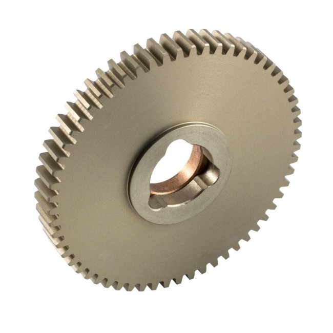
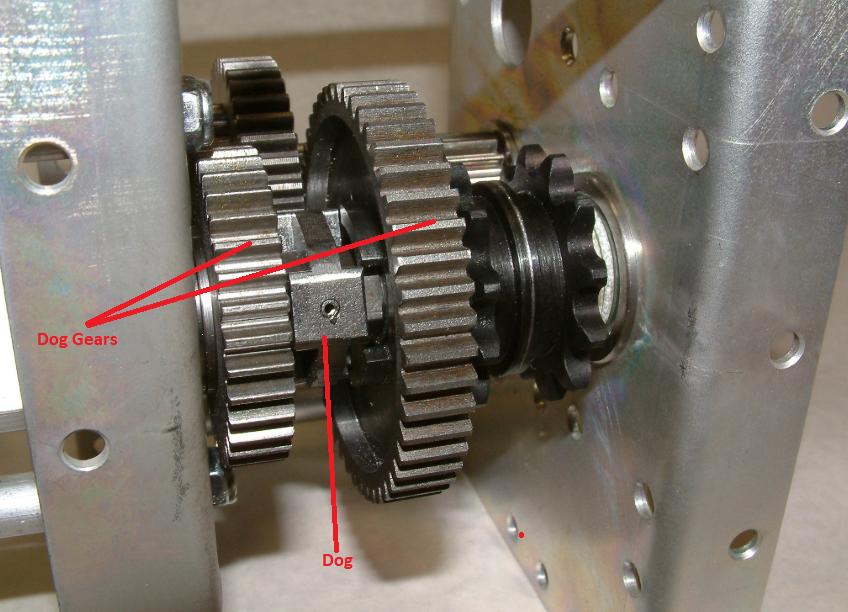
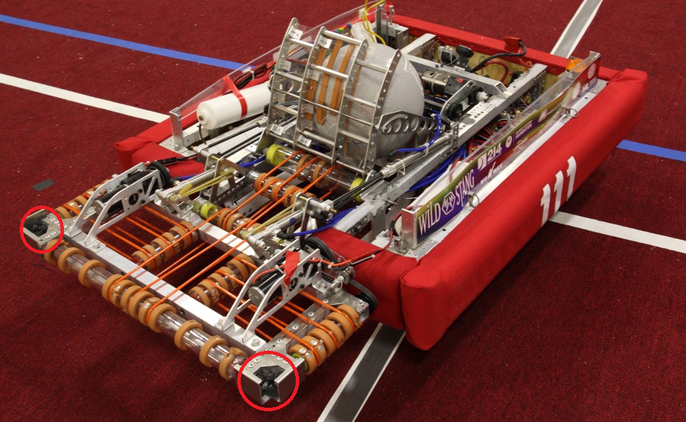

# Other Gears

1. TOC
{:toc}

Beyond typical spur gears discussed in the Gears page, there are several special types of gears that may be encountered in FRC.

## Shifter Gears

Shifter gear setups are common in FRC and allow the gearing ratio for a drivetrain or mechanism to be changed on-demand. Shifting setups in FRC are actuated either by a servo motor with a linkage, or by a pneumatic piston. Servo shifting setups do not produce much torque and cannot shift on-the-fly but instead must fully stop before changing gears. In the event of servo failure the system *should* stay in the last engaged gear due to linkage design. Piston shifting setups can produce enough force to shift on-the-fly and have become the default option in FRC. Some piston shifters also include a spring return built into the piston so even if air pressure is lost the system will default to a chosen gear.

### Ball Shifter Gears

Ball shifters actuate a *shifter rod* to different positions inside of a hollow shifter shaft to force different sets of ball bearings out to transfer torque between the *ball shifter shaft* and a *ball shifter gear*. Ball shifter setups can be extended to multiple gear sets, in FRC ball shifters commonly only two gear sets.

*Ball shifter shaft*: a hollow shaft containing the shifter rod and pockets for ball bearings to seat in. The VexPro ball shifter shaft commonly used in FRC features a female ThunderHex socket with thru pin hole on the output side, by pushing the pin out, heating the shaft to break the factory installed Loctite compound, and pulling the stock output shaft can be removed to be replaced with a longer or otherwise custom output.

*Shifter rod*: a rod contained inside of the ball shifter shaft with a profiled head to force ball bearings out of the shifter shaft and to engage with ball shifter gears.

*Ball shifter gears*: gears with pockets cut into their inner bore to seat ball bearings and transfer torque from a ball shifter shaft. Typically use bronze bushings as a bearing surface for contact with the ball shifter shaft.

### Dog Shifter Gears

Dog shifting setups, similar to ball shifters, actuate between gears to change a system's gearing ratio. Unlike ball shifters, dog shifters cannot be extended to more than two gears. Dog shifters are composed of two primary parts: *dogs* and *dog gears*. Dog shifters tend to be slower than ball shifters to engage in a new gear when shifting.

*Dog*:  a part that prevents movement or imparts movement by offering physical obstruction. In FRC dogs are typically double sided and are used to engage gears in shifting setup.

*Dog gears*: Spur gears with matching features on one side to mate with a dog. Dog gears ride on bearings and transmit no torque until engaged by the dog.

Dog gears can be used to improve gearbox packaging by providing clearance for a large initial gearing reduction in the space between the gears. Example: Team 254 2017 gearbox:

Some teams have reported issues with dog shifting setups in past years; if not designed correctly the force exerted on dogs can break them.

## Bevel Gears

*Bevel gears* are gears where the axes of the two shafts intersect and the tooth-bearing faces of the gears themselves are conically shaped. Bevel gears are most often mounted on shafts that are 90 degrees apart, but can be designed to work at other angles as well. The pitch surface of bevel gears is a cone. A bevel gears in a set with a gearing ratio of 1.0 (same tooth count on both gears) are called *miter gears*.

Unlike spur gears, bevel gears cannot be mixed and matched; a 16 tooth bevel gear designed to mesh with a 60 tooth bevel gear will **not** mesh with another 16 tooth bevel gear.

Common applications for bevel gears in FRC are on roller intakes to allow one motor to power multiple roller shafts, and to transfer power to swerve module wheels. Below is an example of Team 111: Wild Stang's 2016 intake using two pairs of miter gears on a *beaver tail* roller intake.

Unlike spur gears, bevel gears will produce a force along their axis of rotation in addition to the standard tangential separation force.

## Worm Gears

asdf

## Planetary Gears

asdf

## Cycloidal Gears

asdf

