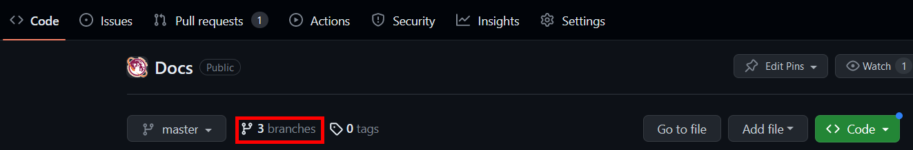
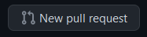

# Software Development Workflow

This document outlines the process to follow when working on software projects on the team.

## GitHub Issues

Github Issues are the way we track the software work we are doing. If you are assigned to an already written issue, you can skip ahead to the [Start Work](#start-work) section.

### Create an Issue

If you find a bug or come up with an idea for something to improve in the code, create an issue. To do this, go to the repository on GitHub, click the Issues tab, and then click "New Issue"


From there, name your issue something descriptive. To fill out the description section, consider using the following template:

```text
**Summary**
// Put a high level summary of the feature to add or problem to solve

**Work Scope**
// Make a list of work items/steps to do to work the task. If you don't know the steps, you could leave this blank and update it later.
- Work item 1
- Work item 2

**Verification**
// Make a list of things that need to be done to confirm that everything works before this issue is closed
- Verification check 1
- Verification check 2
```

On the right side panel, make sure to assign someone, add a label, and add the issue to a project/milestone. You can do this by clicking the gear icons.

## Start Work

When starting work on an issue, it's helpful to mark the Issue as "In Progress" on whatever milestone it's on (if applicable). To start the code work, use your favorite Git client on your computer to checkout and pull the `main` branch (to get the latest updates). In Git bash this looks like:

```bash
git checkout main
git pull
```

Then create a new branch off of `main` with:

```bash
git checkout -b new-branch-name
```

> **Note:** Work on only one github issue per branch. This helps avoid merge conflicts and other confusion when working on projects with other people.

## Write Code

With the branch created, now you can write code. Typically this is done in VS Code when working on the robot codebase. The implementation details are issue specific, but there are best practices to follow outlined in the subsections below.

> **Note:** Make sure you are on the correct branch before writing code.

### Commit and Push

When reaching a development milestone, make sure to commit your code and push it to remote. Some examples of a development milestone are:

- Finishing a step of the work plan
- Completing code prior to making a pull request
- Responding to code reviews

You also **must commit and push your code before leaving at the end of the day.** This allows others to have visibility on what you are working on, and makes it possible for people to keep making progress if you can't make a meeting.

To commit your code, make sure to add the files you want to the commit (stage the changes). To add all the files in the current directory with Git Bash:

```bash
git add .
```

Then make a commit. Commits should have useful messages and it is helpful if they contain a reference to the issue number your branch is related to.

```bash
git commit -m "#issue-number: a helpful and concise message that details the work done in this commit"
```

Finally, push the code to GitHub:

```bash
git push
```

If an error appears, follow instructions in the terminal or ask a lead programmer / mentor.

### Keep Branch Updated

When developing code, the working branch should be kept up to date with the most recent changes. Maintaining your branch is helpful because it:

- Reduces merge conflicts with the `main` branch.
- Increases confidence that your code will work when merged to `main`.

There are many ways to keep the branch updated. We will use rebase because it maintains linear history.

TODO: Put a diagram explaining how rebase works

First, make sure `main` is updated:

```bash
git checkout main
git pull
```

Now you can rebase the current branch on top of `main` like so:

```bash
git checkout branch-you-want-to-rebase
git rebase main
```

Rebase works by going through each commit and stacking it on top of the parent branch (in this case `main`). If there are merge conflicts for any commit, rebase will pause for you to resolve the conflict. You can resolve the conflict in VS Code and then do the following to continue the rebase:

```bash
git add .
git rebase --continue
```

After a successful rebase, whenever you want to push the code to GitHub you will need to do so with force. It is best practice to do the following:

```bash
git push --force-with-lease
```

However, if you know that nobody else is working on your branch you can do

```bash
git push -f
```

## Make a Pull Request

Once you believe your code is ready to merge into the `main` branch, make a pull request (PR) on GitHub. The first time you push a branch in Git bash (or any command line interface), git will give you a link to create a PR. You can do this even if the code is ready (see [Draft Pull Requests](#draft-pull-requests)), but if you didn't use the link you can create a PR using the following steps

1. Navigate to the repository on GitHub
2. Click on the Branches button:

3. Look for your branch. Click the "New Pull Request" button:



- If the "New Pull Request" button isn't available, then a PR already exists for the branch. You should be able to see that for your branch.

4. Name the pull request something descriptive and fill out the description with a bulleted list of changes you made.

5. Click "Create pull request" (or hit the down arrow and click "Create draft pull request" if it isn't ready for review).
6. If creating a PR for review (not a draft), then assign someone on the programming team to review it.

### Draft Pull Requests

You can create draft PRs whenever you have some code that isn't ready to review. This can be helpful to see the code diff prior to asking for a review.

When your draft PR is ready for review, mark it as "Ready for Review" and then assign someone to review the PR.

## Code Review

### As the Reviewer

Things you should do during a code review:

- Check that code quality standards are being followed
- Ensure that the changes are the ones we wanted to make (see the relevant ticket for details)
- See if any new algorithm logic makes sense
- Look to see if any important code was deleted
- Request additional code comments if things aren't very clear
- Leave helpful code snippets in comments if needed
- Ask questions about the code if something doesn't make sense
- Resolve your comments whenever the code author addresses the problem

Things you should avoid doing as the code reviewer:

- Write new code for the PR
- Closing the pull request. Let the code author do this if needed
- Merging the code. Let the code author do this

Leave comments by clicking on lines of code and writing a message. You can leave single comments or start a review - starting a review is preferred. Then you can leave an overall message on the review when you submit your review status (Accepted, Changes Requested, or Comment).

If you don't want to accept the code changes due to problems you see, you should "Request Changes". If you just have comments or general questions, Comment is the best status to set. Of course if the code is good to go, then you would want to Accept the changes.

### As the Author

Things you should do during a code review as the code author:

- Respond to comments made by reviewer(s) and push new code as needed
- Keep the branch up to date by rebasing
- "Squash and Merge" the code when the review is Accepted and CI passes

Things you should avoid doing during a code review:

- Resolving comments by reviewer(s). Let them resolve their comments when they are satisfied that they have been answered
- Updating the branch with the GitHub "Update Branch" button
  - You can do this if the code is accepted and CI is passing. But if you do it before that, then it creates a merge commit and makes your own development more difficult if you need to make changes
- Merging the code prior to CI passing and/or review approval
  - The repository settings should not allow this, but don't do it. You can use "auto-merge" if you don't want to wait for CI to pass and GitHub will merge your code for you.

## Finish Work

Once all work is complete on a GitHub issue (via one or more PRs), leave a comment in the issue with the relevant PR(s) that did the work and close the issue.
