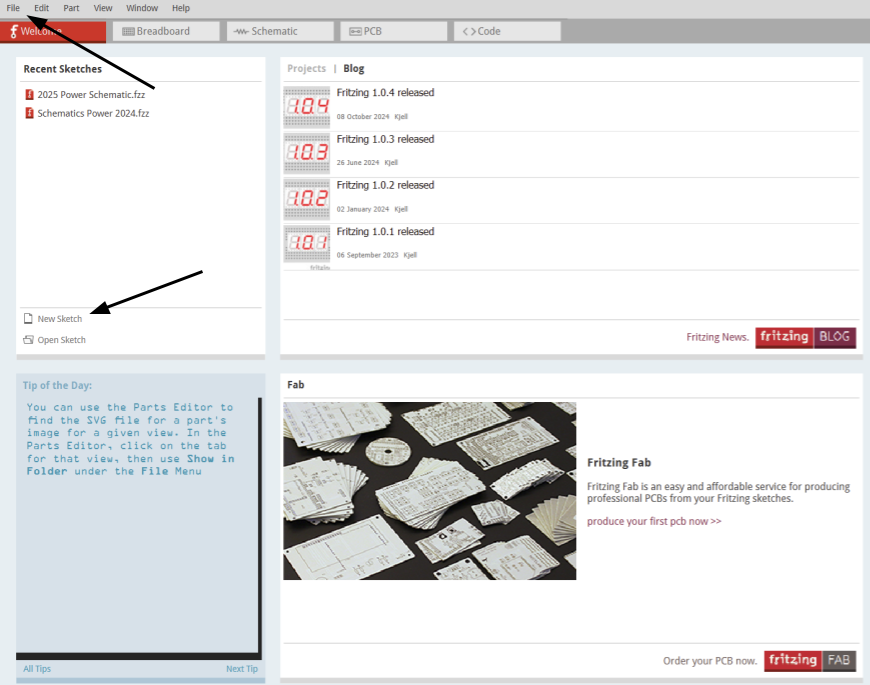
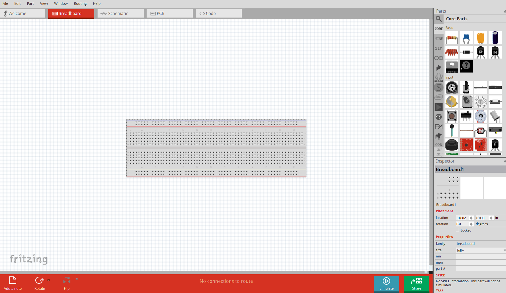
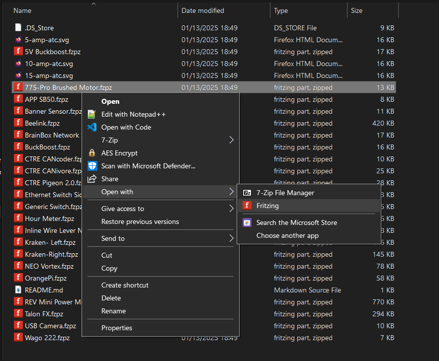
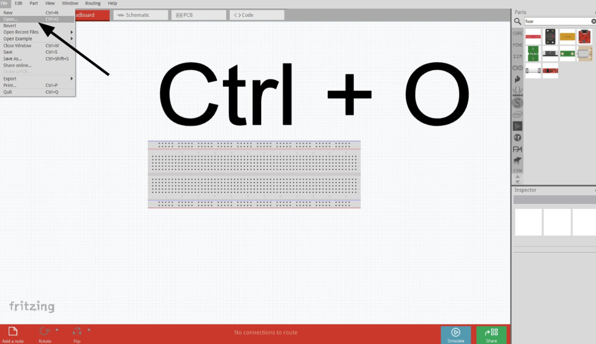
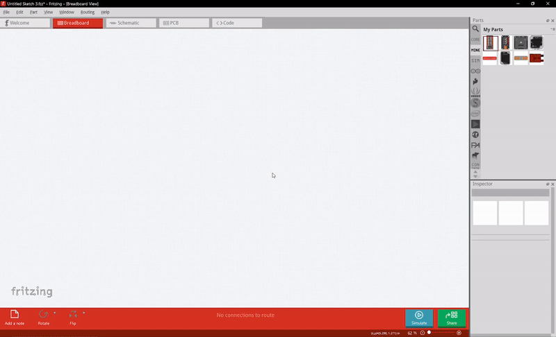
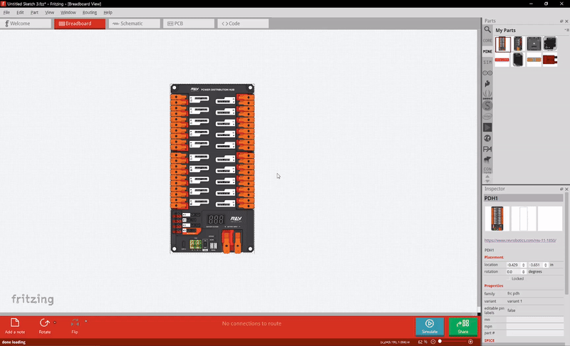
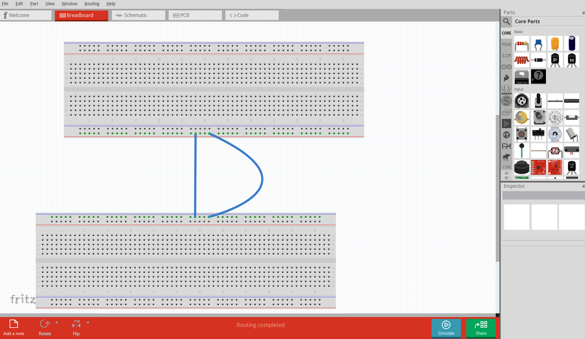
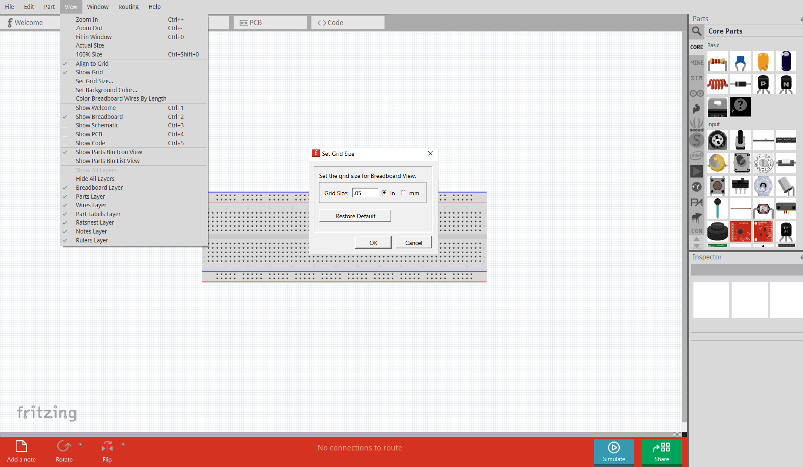

# Fritzing

Team 401 uses Fritzing to create robot wiring diagrams in order to clearly show the components and connections in our controls system.

## Getting Started

### Getting Fritzing

Fritzing install files for Windows, Mac, and Linux are available in the team leadership drive. Ask a subteam lead or MCPS coach if you need help getting access to them.

### Downloading Parts

Team 401 has developed some of their own parts of the past few years, which can be found and downloaded from the [team's GitHub](https://github.com/team401/FRC-Fritzing-Parts). You can also find some of the more common FRC parts at this [other FRC mentor's GitHub repo](https://github.com/AronRubin/FRCFritzingParts). Simply save the parts to whatever directory you would like, but keep in that if they are moved Fritzing will not be able to find and load them.

### Sketch Setup

Click the "New Sketch Button" to create a new sketch. You can also click "File", then "New Sketch" from the dropdown menu or press "Ctrl + N" on your keyboard.

The new sketch will open into the "Breadboard" tab, where you will be doing most of your work for schematics. The "Schematics" tab will show the underlying circuitry of whatever component you're working with and will not be used in our case.

## Fritzing Electrical Basics

### Loading Parts into Fritzing

In order to place a part from either the 401 Parts or from another source, simply download the Fritzing Parts Files, either a .fzp or a .fzpz filetype, to the directory fo your choice. Then, either open the part using fritzing from your file exlporer to load it into your bin.

Alternatively, open it in the editor by either pressing "Ctrl + O" on your keyboard, or clicking "File" in the top left corner and then clicking "Open" inn the dropdown menu. Then select the part you would like to import.

After loading a part into Fritzing, you can find it in the "My Parts" bin, which is marked as "MINE" on the scrollbar for the "Parts" menu. If you want to create a new bin, simply left click on the "Parts" menu.

### Placing, Moving, and Deleting Parts

To place a part into the Bread Board Section, simply drag it from the "Parts" section on the right side of the screen once it has been loaded into Fritzing.  

To move parts around simply left click on them with your mouse and drag them to your desired location. You can also select a part with the mouse and change it's x and y coordinate in the "Inspector" menu, which can be found in the lower half of the right side of the screen.

To delete parts, simply left click on the part and press the "Delete" key on your keyboard. Alternatively, you can right click on the part and select "Delete" in the dropdown menu.

## Fritzing Tips and Tricks

Straight wires look good, but it's often hard to have that happen with freehand dragging in Fritzing, instead, you can hold down the "Shift" key on your keyboard, restricting your wires to only bend at angles that are a multiple of 45° (0°, 45°, 90°, etc.). If instead you want to make a wire curve, attach it to it's final location (where you want to wire it to), and then while holding down "Ctrl" on your keyboard drag the wire. This will cause the wire to curve to where you cursour drags.

You can enable, disable, or alter the size and properties of the grid by clicking "View" on the top of the screen. Then you can disable objects snapping to the grid by clicking the "Align to Grid Option" to change the size of the grid, instead click "Set Grid Size..." which will open a popup video where you can set the desired size.

