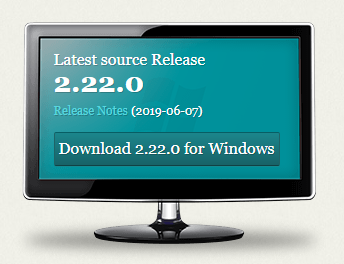

# Installing Git

On Windows, follow [this link](https://git-scm.com/) to go to the Git homepage.



Click the blue download button inside the picture of a computer monitor.  This screenshot shows the Windows version selected, but the link should automatically be set for whatever operating system you are using.

If you are on a Linux or Macintosh, `git` should already be installed or can
be installed through the package manager of your OS.

## Setting up git access to a repository
When you are cloning a private repository, or pushing changes to one, you need
to be authenticated by Github.  This requires the use of a private key or of
a token.  We suggest that you create a personal access token (PAT).

Go to [Personal Access Tokens](https://github.com/settings/tokens) on github.com.
The [link](https://github.com/settings/tokens) should work, if it doesn't, go to 
Settings, then Developer Settings, then Personal Access Tokens:


Check the repo box, give it a name and an expiration date, and create the token.
Once created, make a copy of it - it will be displayed only once.
Keep the copy secure.

Your token will look like this: `ghp_rv4djkhsdfEWIkJHSKJfd787fsRV`.

Now you are able to use this token as follows.
Whenever you are cloning a Github repository, use the `https` method (not `ssh`)
and insert the token in the URL.

For instance, the repo for these Docs is at `https://github.com/team401/Docs.git` when 
using the `https` methods, which is shown here:


You would therefore use
`https://ghp_rv4djkhsdfEWIkJHSKJfd787fsRV@github.com/team401/Docs.git` to clone 
it using your token, for instance,
```
git clone https://ghp_rv4djkhsdfEWIkJHSKJfd787fsRV@github.com/team401/Docs.git
```

It is also possible to change the method of authentication after the fact.
We could use this on shared laptops that may be used by multiple students
if they end up working in the same project directory.
For instance, to change the current upstream URL of a repo, use
```
git remote set-url origin https://ghp_rv4djkhsdfEWIkJHSKJfd787fsRV@github.com/team401/Docs.git
```
To ensure that commit messages appear under your name, you should also reset
the name and email settings for this repo.
```
git config --local user.email your@email
git config --local user.name "Your Name"
```

*Note* this method is **not** necessary if students work in different project
directories. In that case, the settings from the active project directory will be used.

*Side note* an alternative authentication method is to use private ssh keys, in which case 
the remote URL will start with `git@github.com`, e.g. `git@github.com:team401/Docs.git`.
