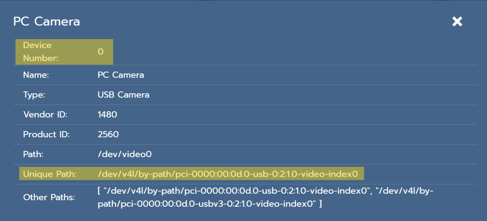
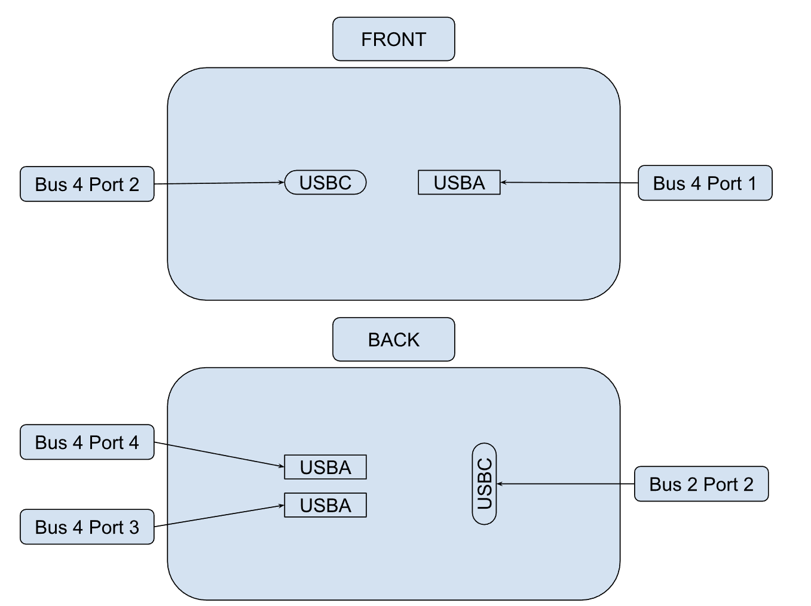

# Setting Up The Cameras
## Ports of the PC

The PhotonVision system determines the order of device IDs based upon whichever order they are plugged in. Therefore, to identify a specific port, use the unique path that PhotonVision provides in the camera details.

The following image is an example of a camera's details as displayed in PhotonVision, with the camera's device ID (indicated by the device number) and the unique path of the port where the camera is plugged in highlighted in yellow.

{width=50%}

Here is a chart to identify the ports and buses for each USB input in our current PC:

{width=75%}

